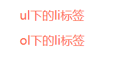
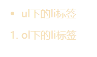
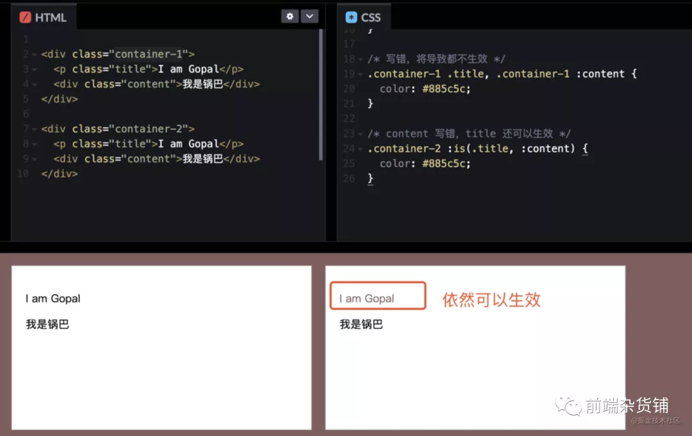
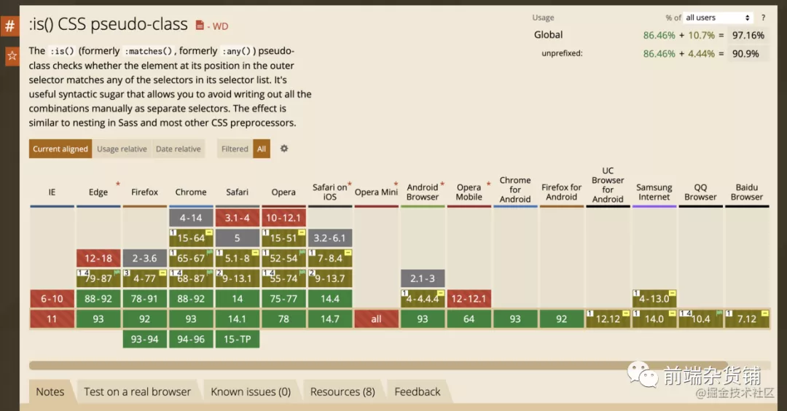

 ## :is()是什么？
 is() 是一个 CSS 伪类函数，该函数将选择器列表作为参数，并选择该列表中任意一个选择器可以选择的元素。举个例子就比较清晰的理解：
 ```css
    ul li,
    ol li {
      list-style: none;
      color: tomato;
      font-size: 20px;
    }
 ```

 效果如下：

  

 使用is()：
 ```css
    :is(ul, ol) li {
      color: wheat;
      font-size: 20px;
    }
 ```

 效果如下：

  

  ##  为什么要使用is()
 当我们系统比较复杂，is() 可以帮助我们简化代码，如下：
 ```css
    ol ol ul,     ol ul ul,     ol menu ul,     ol dir ul,
    ol ol menu,   ol ul menu,   ol menu menu,   ol dir menu,
    ol ol dir,    ol ul dir,    ol menu dir,    ol dir dir,
    ul ol ul,     ul ul ul,     ul menu ul,     ul dir ul,
    ul ol menu,   ul ul menu,   ul menu menu,   ul dir menu,
    ul ol dir,    ul ul dir,    ul menu dir,    ul dir dir,
    menu ol ul,   menu ul ul,   menu menu ul,   menu dir ul,
    menu ol menu, menu ul menu, menu menu menu, menu dir menu,
    menu ol dir,  menu ul dir,  menu menu dir,  menu dir dir,
    dir ol ul,    dir ul ul,    dir menu ul,    dir dir ul,
    dir ol menu,  dir ul menu,  dir menu menu,  dir dir menu,
    dir ol dir,   dir ul dir,   dir menu dir,   dir dir dir {
      list-style-type: square;
    }
 ```
 
 可简化成：
 ```css
  :is(ol, ul, menu, dir) :is(ol, ul, menu, dir) ul,
  :is(ol, ul, menu, dir) :is(ol, ul, menu, dir) menu,
  :is(ol, ul, menu, dir) :is(ol, ul, menu, dir) dir {
    list-style-type: square;
  }
 ```
 ## 可避免css错误
 假如我们的 CSS 中有错误，将导致整个选择器不生效。比如下面的 .content 写成 :content。
  
 前者会导致都不生效，但是:is()，.title 选择器依然可以生效

 ## is()的兼容性
 
  