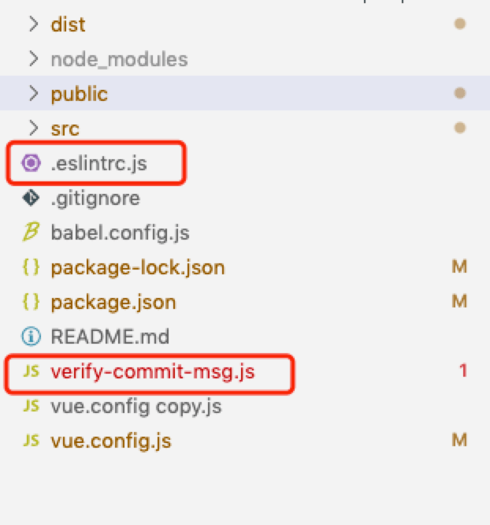

## 1、创建：verify-commit-msg.js
#### 复制以下代码内容，在根目录下创建verify-commit-msg.js
```js
const chalk = require('chalk')

const msgPath = process.env.GIT_PARAMS
const msg = require('fs').readFileSync(msgPath, 'utf-8').trim()

const commitRE = /^(revert: )?(feat|fix|docs|style|refactor|perf|test|workflow|ci|chore|types)(\(.+\))?: .{1,50}/

if (!commitRE.test(msg)) {
  console.log()
  console.error(
    `  ${chalk.bgRed.white(' ERROR ')} ${chalk.red('invalid commit message format.')}\n\n${chalk.red('  Proper commit message format is required for automated changelog generation. Examples:\n\n')}
    ${chalk.green('feat(compiler): add "comments" option')}\n` +
    `${chalk.green('fix(v-model): handle events on blur (close #28)')}\n\n${chalk.red('  See .github/COMMIT_CONVENTION.md for more details.\n')}${chalk.red(`  You can also use ${chalk.cyan('npm run commit')} to interactively generate a commit message.\n`)}`,
  )
  process.exit(1)
}
```

## 2、配置package.json
#### 添加以下内容
#####  <font color='red'>注意：</font>查看是否有 @vue/cli-plugin-eslint 插件，没有先安装 npm i @vue/cli-plugin-eslint --save-dev
```js
"gitHooks": {
  "pre-commit": "npm run lint",
  "commit-msg": "node verify-commit-msg.js"
},
"config": {
  "commitizen": {
    "path": "./node_modules/cz-conventional-changelog"
  }
}
```
#### 中文版配置，执行命令 <font color='red'>npm i cz-conventional-changelog-zh --save-dev</font>，配置如下：

::: details 点击查看配置
```js
"gitHooks": {
  "pre-commit": "npm run lint",
  "commit-msg": "node verify-commit-msg.js"
},
"config": {
  "commitizen": {
    "path": "./node_modules/cz-conventional-changelog-zh",
    "types": {
      "feat": {
        "description": "一个新功能",
        "title": "Features"
      },
      "fix": {
        "description": "修改bug",
        "title": "Bug Fixes"
      },
      "docs": {
        "description": "文档增删改",
        "title": "Documentation"
      },
      "style": {
        "description": "样式修改(空白、格式、缺少分号等)",
        "title": "Styles"
      },
      "refactor": {
        "description": "既不修复bug也不添加新功能的更改",
        "title": "Code Refactoring"
      },
      "perf": {
        "description": "性能优化",
        "title": "Performance Improvements"
      },
      "test": {
        "description": "增加测试",
        "title": "Tests"
      },
      "build": {
        "description": "影响构建系统或外部依赖项的更改(如:gulp、broccoli、npm)",
        "title": "Builds"
      },
      "ci": {
        "description": "对CI配置文件和脚本的更改(如:Travis, Circle, BrowserStack, SauceLabs)",
        "title": "Continuous Integrations"
      },
      "chore": {
        "description": "除src目录或测试文件以外的修改",
        "title": "Chores"
      },
      "revert": {
        "description": "回退历史版本",
        "title": "Reverts"
      },
      "conflict": {
        "description": "修改冲突",
        "title": "Conflict"
      },
      "font": {
        "description": "字体文件更新",
        "title": "Fonts"
      },
      "delete": {
        "description": "删除文件",
        "title": "Delete Files"
      },
      "stash": {
        "description": "暂存文件",
        "title": "Stash Files"
      }
    }
  }
},
```
:::

## 3、添加esLint规则文件
:::tip
此文件为esLint检验规则，如果项目已经启用esLint，在根目录下已有<font color='red'>.eslintrc.js</font>，否则需要自行在根目录创建，代码如下
:::

::: details 点击查看配置

```js
module.exports = {
  root: true,
  parserOptions: {
    parser: 'babel-eslint',
    sourceType: 'module'
  },
  env: {
    browser: true,
    node: true,
    es6: true,
  },
  extends: ['plugin:vue/recommended', 'eslint:recommended'],

  rules: {
    "vue/max-attributes-per-line": [2, {
      "singleline": 10,
      "multiline": {
        "max": 1,
        "allowFirstLine": false
      }
    }],
    "vue/singleline-html-element-content-newline": "off",
    "vue/multiline-html-element-content-newline": "off",
    "vue/name-property-casing": ["error", "PascalCase"],
    "vue/no-v-html": "off",
    'accessor-pairs': 2,
    'arrow-spacing': [2, {
      'before': true,
      'after': true
    }],
    'block-spacing': [2, 'always'],
    'brace-style': [2, '1tbs', {
      'allowSingleLine': true
    }],
    'camelcase': [0, {
      'properties': 'always'
    }],
    'comma-dangle': [2, 'never'],
    'comma-spacing': [2, {
      'before': false,
      'after': true
    }],
    'comma-style': [2, 'last'],
    'constructor-super': 2,
    'curly': [2, 'multi-line'],
    'dot-location': [2, 'property'],
    'eol-last': 0,
    'eqeqeq': ["error", "always", { "null": "ignore" }],
    'generator-star-spacing': [2, {
      'before': true,
      'after': true
    }],
    'handle-callback-err': [2, '^(err|error)$'],
    'indent': [2, 2, {
      'SwitchCase': 1
    }],
    'jsx-quotes': [2, 'prefer-single'],
    'key-spacing': [2, {
      'beforeColon': false,
      'afterColon': true
    }],
    'keyword-spacing': [2, {
      'before': true,
      'after': true
    }],
    'new-cap': [2, {
      'newIsCap': true,
      'capIsNew': false
    }],
    'new-parens': 2,
    'no-array-constructor': 2,
    'no-caller': 2,
    'no-console': 'off',
    'no-class-assign': 2,
    'no-cond-assign': 2,
    'no-const-assign': 2,
    'no-control-regex': 0,
    'no-delete-var': 2,
    'no-dupe-args': 2,
    'no-dupe-class-members': 2,
    'no-dupe-keys': 0,
    'no-duplicate-case': 2,
    'no-empty-character-class': 2,
    'no-empty-pattern': 2,
    'no-eval': 2,
    'no-ex-assign': 2,
    'no-extend-native': 2,
    'no-extra-bind': 2,
    'no-extra-boolean-cast': 2,
    'no-extra-parens': [2, 'functions'],
    'no-fallthrough': 2,
    'no-floating-decimal': 2,
    'no-func-assign': 2,
    'no-implied-eval': 2,
    'no-inner-declarations': [2, 'functions'],
    'no-invalid-regexp': 2,
    'no-irregular-whitespace': 2,
    'no-iterator': 2,
    'no-label-var': 2,
    'no-labels': [2, {
      'allowLoop': false,
      'allowSwitch': false
    }],
    'no-lone-blocks': 2,
    'no-mixed-spaces-and-tabs': 2,
    'no-multi-spaces': 2,
    'no-multi-str': 2,
    'no-multiple-empty-lines': [2, {
      'max': 1
    }],
    'no-native-reassign': 2,
    'no-negated-in-lhs': 2,
    'no-new-object': 2,
    'no-new-require': 2,
    'no-new-symbol': 2,
    'no-new-wrappers': 2,
    'no-obj-calls': 2,
    'no-octal': 2,
    'no-octal-escape': 2,
    'no-path-concat': 2,
    'no-proto': 2,
    'no-redeclare': 2,
    'no-regex-spaces': 2,
    'no-return-assign': [2, 'except-parens'],
    'no-self-assign': 2,
    'no-self-compare': 2,
    'no-sequences': 2,
    'no-shadow-restricted-names': 2,
    'no-spaced-func': 2,
    'no-sparse-arrays': 2,
    'no-this-before-super': 2,
    'no-throw-literal': 2,
    'no-trailing-spaces': 2,
    'no-undef': 0, // 修改 2
    'no-undef-init': 2,
    'no-unexpected-multiline': 2,
    'no-unmodified-loop-condition': 2,
    'no-unneeded-ternary': [2, {
      'defaultAssignment': false
    }],
    'no-unreachable': 2,
    'no-unsafe-finally': 2,
    'no-unused-vars': [2, {
      'vars': 'all',
      'args': 'none'
    }],
    'no-useless-call': 2,
    'no-useless-computed-key': 2,
    'no-useless-constructor': 2,
    'no-useless-escape': 0,
    'no-whitespace-before-property': 2,
    'no-with': 2,
    'one-var': [2, {
      'initialized': 'never'
    }],
    'operator-linebreak': [2, 'after', {
      'overrides': {
        '?': 'before',
        ':': 'before'
      }
    }],
    'padded-blocks': [2, 'never'],
    'quotes': [2, 'single', {
      'avoidEscape': true,
      'allowTemplateLiterals': true
    }],
    'semi': [2, 'never'],
    'semi-spacing': [2, {
      'before': false,
      'after': true
    }],
    'space-before-blocks': [2, 'always'],
    'space-before-function-paren': [2, 'never'],
    'space-in-parens': [2, 'never'],
    'space-infix-ops': 2,
    'space-unary-ops': [2, {
      'words': true,
      'nonwords': false
    }],
    'spaced-comment': [2, 'always', {
      'markers': ['global', 'globals', 'eslint', 'eslint-disable', '*package', '!', ',']
    }],
    'template-curly-spacing': [2, 'never'],
    'use-isnan': 2,
    'valid-typeof': 2,
    'wrap-iife': [2, 'any'],
    'yield-star-spacing': [2, 'both'],
    'yoda': [2, 'never'],
    'prefer-const': 2,
    'no-debugger': process.env.NODE_ENV === 'production' ? 2 : 0,
    'object-curly-spacing': [2, 'always', {
      objectsInObjects: false
    }],
    'array-bracket-spacing': [2, 'never'],
    'vue/require-prop-types': 0,
    'vue/html-indent': 0,
    'vue/no-unused-components': 2,
    'vue/html-self-closing': 0
  }
}

```
:::

#### 配置完毕后根目录存在 <font color='red'>verify-commit-msg.js、.eslintrc.js</font> 文件
<br/>


## 4、配置git cz
#### 全局安装 <font color='red'>npm install -g git-cz</font>
#### git add 后运行 git cz ，代替commit命令，选择提交类型，类型如下：
``` bash
# feat： 新增feature
# fix: 修复bug
# docs: 仅仅修改了文档，比如README, CHANGELOG, CONTRIBUTE等等
# style: 仅仅修改了空格、格式缩进、逗号等等，不改变代码逻辑
# refactor: 代码重构，没有加新功能或者修复bug
# perf: 优化相关，比如提升性能、体验
# test: 测试用例，包括单元测试、集成测试等
# chore: 改变构建流程、或者增加依赖库、工具等
# revert: 回滚到上一个版本
```

#### 根据提示填写提交信息，提示依次如下：
``` bash
# 1、What is the scope of this change: 填写更改的文件目录（可直接回车）
# 2、Write a short, imperative tense description of the change: 填写提交描述
# 3、Provide a longer description of the change: 填写更具体的描述（可直接回车）
# 4、Are there any breaking changes? (y/N)：是否有突破性进展，默认是NO（可直接回车）
# 5、Does this change affect any open issues：是否影响其他问题，默认是NO（可直接回车）
```

#### 之后进行后续的正常git提交流程，如git pull、git push等操作

#### 中文版根据提示操作即可