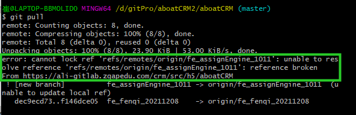
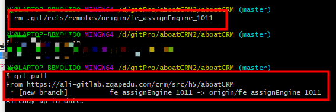
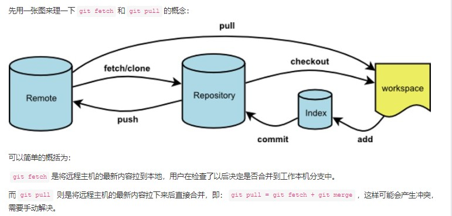

# Git问题

### Git-error:error: cannot lock ref 'refs/remotes/origin/XXX': unable to resolve reference 'XXX....

问题出现场景：

在master上git pull 拉取远程代码和分支时，有一个分支拉取不到

<br/>

在本地的上分支xxx并不存在于远程，其实远程上实际存在。

解决办法：

```js
rm .git/refs/remotes/origin/XXX    对应删除你报错的分支
git fetch 拉取远程分支代码   （或者 git pull）
```

<br/>

附： git fetch  和 git pull 的区别

<br/>

