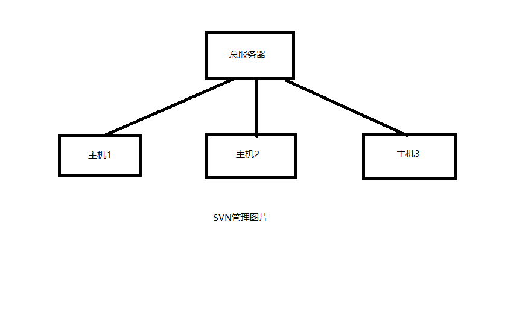

### git与svn的区别
 #### 1.Git是分布式的。SVN是集中式的。
 

 

SVN服务器版本库放在一个中央服务器。所有开发人员都是与服务器进行交互的。开发时从中央服务器得到最新的版本，开发完需把自己做的工作推送到中央服务器。

Git不需要有中心服务器，每台电脑拥有的东西都是一样的。使用Git有个中心服务器，为了方便修改。所以git的开发流程是工作的时候不需要联网了，因为版本库就在你的电脑上。比如你在自己的电脑上修改了文件A，你同事也在她的电脑上修改了文件A，这时，你们之间只需要把自己的修改推送给对方。就可以看到了对方的修改了。

Git更倾向于分布式开发，每台计算机上都有一个完整的本地版本库。和服务器上的一模一样。

#### 2.分支功能
Svn 创建分支，创建了一个新的文件夹（目录）并拥有实际的文件的。相当于拷贝了一份源文件。如果一个成员创建了一个分支，将会影响所有的人。所有的人都将拥有同样的分支。

Git创建分支，并没有创建文件夹，甚至看不到任何的改变。用户可以在同一个文件夹中，快速的切换不同的分支。创建一个分支，就是多了一个索引文件，记录这个分支的变化。占用很小的空间。每个分支，都是独立的。

#### 3.提交
SVN，当你提交你的代码时，它将直接记录到中央版本库。当你发现代码存在严重问题时，你已经无法阻止事情的发生了。如果网路中断，你根本没办法提交！

Git的提交完全属于本地版本库的活动。而你只需（git push）到主要版本库即可。Git的push其实是在执行同步

### Git优缺点
#### 优点： 

1、适合分布式开发，强调个体。 

2、公共服务器压力和数据量都不会太大。 

3、速度快、灵活。 

4、任意两个开发者之间可以很容易的解决冲突。 

5、离线工作。 

缺点： 

1、代码保密性差，一旦开发者把整个库克隆下来就可以完全公开所有代码和版本信息。

### SVN优缺点

优点： 

1、 管理方便，逻辑明确。 

2、 易于管理，集中式服务器更能保证安全性。 

3、 代码一致性非常高。 

4、 适合开发人数不多的项目开发。 

缺点： 

1、 服务器压力太大，数据库容量暴增。 

2、 如果连不上服务器，就不能提交，还原，对比等等，基本上不可以工作。 

3、 不适合开源开发。但是一般集中式管理的有非常明确的权限管理机制（例如分支访问限制），可以实现分层管理，从而很好的解决开发人数众多的问题。