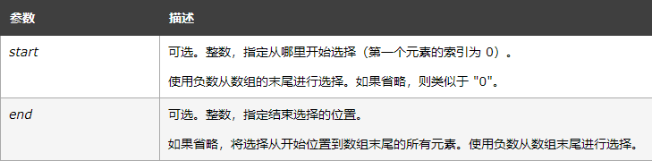
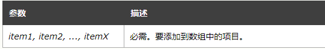
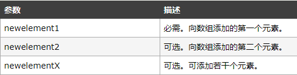
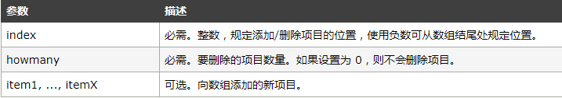
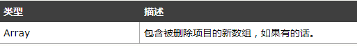

# 数组的常用方法 (一)

## 一、不改变原数组的方法

### 1. concat()

语法：arrayObject.concat(arrayX,arrayX,......,arrayX)

 输入值： 输入值可以是单个元素（多个元素），也可以是单个数组（多个数组）

功能：连接两个或多个数组

返回值：返回被连接数组的一个副本

ex1: 输入值为多个元素

```js
var arr = [1,2,3];
var arr2 = arr.concat(4,5,6);
console.log("arr: " + arr);  //arr: [1,2,3]
console.log("arr2: " + arr2);  //arr2: [1,2,3,4,5,6]
```

ex2:输入值为数组/(多个数组)

```js
var arr3 = arr.concat([7,8]);
console.log("arr: " + arr);  // arr: [1,2,3]
console.log("arr3: " + arr3);  // arr3: [1,2,3,7,8]

var arr4 = arr.concat([9,10],[11,12]);
console.log("arr: " + arr);  // arr: [1,2,3]
console.log("arr4: " + arr4);  // arr4: [1,2,3,9,10,11,12]
```

### 2.  join()

语法：arrayObject.join(separator)   (发音注：美[ˈsepəreɪtər] 分离器)

输入值：分隔符

功能：把数组中的所有元素放入一个字符串中

返回值：返回一个字符串。该字符串是通过把 arrayObject 的每个元素转换为字符串，然后把这些字符串连接起来，在两个元素之间插入 separator 字符串而生成的。

ex:

```js
var arr = ['a','b','hhh']; 
var str1 = arr.join(); //str1=> "a,b,hhh"s
var str2 = arr.join('-'); //str2=> "a-b-hhh"
```

### 3. slice()

语法：arrayObject.slice(start,end)---包括start但不包括end，没有找到元素，则返回空的数组

输入值：

<!--  -->
<br/>

功能：从原数组中截取一个新的数组

返回值：返回一个新的数组，包含从 start 到 end （不包括该元素）的 arrayObject 中的元素

ex：// arrayObject.slice(start,end)

```js
var arr = [1,2,3,4,5];
console.log('arr.slice(0): ' + arr.slice(0)); //arr.slice(0): 1,2,3,4,5
console.log('arr.slice(0,5): ' + arr.slice(0,5));//超出数组最大的index值，则忽略超出部分arr.slice(0,5): 1,2,3,4,5
console.log('arr.slice(0,1): ' + arr.slice(0,1)); //arr.slice(0,1): 1
console.log('arr.slice(0,-1): ' + arr.slice(0,-1));//arr.slice(0,-1): 1,2,3,4
console.log('arr.slice(-3,-1): ' + arr.slice(-3,-1));//arr.slice(-3,-1): 3,4
console.log('arr.slice(-2,-3): ' + {}.toString.call(arr.slice(-2,-3)));//第一个下标要大于第二个下标，否则返回的是空的数组
console.log('arr.slice(-1,-3): ' + arr.slice(-1,-3)); //slice()的第一个参数要小于第二个参数
var arr = [1,2,3,4,5];
let tmp =arr.slice(5);
console.log({}.toString.call(tmp)); //没有找到元素，返回的是空的数组'[object Array]'
其中负数：//负数+数组长度,来确定相应的位置。NaN=>0
var arr1 = ["a", "b", "c", "d", "e"];
arr1.slice(-1,-2);//=>arr1.slice(-1+5,-2+5);=>arr1.slice(4,3)=>[]
arr1.slice(-2,-1);//=>arr1.slice(-2+5,-1+5);=>arr1.slice(3,4)=>["d"]
```

### 4. toString()

语法：booleanObject.toString()

输入值：无

功能：把一个逻辑值转换为字符串，并返回结果

返回值：根据原始布尔值或者booleanObject对象的值返回字符串"true"或“false”

ex：// booleanObject.toString()

```js
var boo = new Boolean(true)
console.log(boo.toString());  // true
var arr = new Array();
console.log(arr.toString()); //console显示的是空的
```

## 二、改变原数组

### 1. pop()

语法：arrayObject.pop()

输入值：无

功能：用于删除并返回数组的最后一个元素

返回值：被删除的元素；如果是空数组则不改变数组，返回undefined

ex：// arrayObject.pop()

```js
var arr = [1,2,3];
console.log('arr: '+ arr);  //arr: [1,2,3]
console.log('the pop element: '+ arr.pop()); // the pop element: 3
console.log('arr: '+ arr);  //arr: [1,2]
```

### 2. push()

语法：arrayObject.push(newelement1,newelement2,....,newelementX)

输入值：

<!--  -->
<br/>

功能：向数组的末尾添加一个或多个元素

返回值：把指定的值添加到数组之后的新长度

ex：// arrayObject.push(newelement1,newelement2,....,newelementX)

```js
var arr = [1,2,3];
console.log('arr: '+ arr); // arr:[1,2,3]
console.log('the new length: '+ arr.push(4,5));  // the new length: 5
console.log('arr: '+ arr);  //arr: [1,2,3,4,5]
```

### 3. shift()

语法：arrayObject.shift()

输入值：无

功能：把数组的第一个元素从其中删除

返回值：数组原来的第一个元素的值

ex：// arrayObject.shift()

```js
var arr = [1,2,3];
console.log('arr: '+ arr);  //arr: [1,2,3]
console.log('the shift element: '+ arr.shift());  //the shift element: 1
console.log('arr: '+ arr);  // arr:[2,3]
```

### 4. unshift()

语法：arrayObject.unshift(newelement1,newelement2,....,newelementX)

输入值：

 

<br/>


功能：向数组的开头添加一个或多个元素

返回值：返回数组的新长度

ex：// arrayObject.unshift(newelement1,newelement2,....,newelementX)

```js
var arr = [1,2,3];
console.log('arr: '+ arr);  // arr: [1,2,3]
console.log('the new length: '+ arr.unshift(14,5));  // the new length: 5
console.log('arr: '+ arr);  // arr: [14,5,1,2,3]
```

### 5. splice()

语法：arrayObject.splice(index,howmany,item1,.....,itemX)

输入值：

<br/>

功能：向数组添加项目或者从数组中删除项目

返回值：

<br/>

向/从 数组中添加/删除项目，然后返回被删除的项目

ex: // arrayObject.splice(index,howmany,item1,.....,itemX)

```js
var arr = [1,2,3];
console.log('arr: '+ arr);  // arr: [1,2,3]
console.log('delete element: '+ arr.splice(0,1));  // delete element: 1
console.log('arr: '+ arr);  // arr: [2,3]
console.log('do not delete element: '+ arr.splice(0,0,6));  // do not delete element:
console.log('arr: '+ arr);  // arr: [6,2,3]
```

### 6. reverse()

语法： arrayObject.reverse()

输入值：无

功能：用于颠倒数组中的元素的顺序

返回值：返回颠倒顺序之后的数组

ex：// arrayObject.reverse()

```js
var arr = [1,2,3];
console.log('arr: ' + arr);  // arr: [1,2,3]
console.log('reverse arr: ' + arr.reverse());  // reverse arr: [3,2,1]
console.log('arr: '+ arr);  // arr: [3,2,1]
```

### 7. sort()

语法：arr.sort()  或者 arr.sort(compareFunction)

输入值；无 或者 函数（用来指定按某种顺序进行排列的函数。如果省略，元素按照转换为的字符串的各个字符的Unicode位点进行排序）

功能：排序

返回值：排序之后的数组

ex1：// arr.sort()   

```js
var numbers = [4, 2, 5, 10, 3];
numbers.sort();
console.log(numbers);  // [ 10, 2, 3, 4, 5 ]
```

ex2：// arr.sort(compareFunction)

```js
var numbers = [4, 2, 5, 1, 3];
numbers.sort(function(a, b) {
return a - b;
});
console.log(numbers);  // [ 1, 2, 3, 4, 5 ]
```

