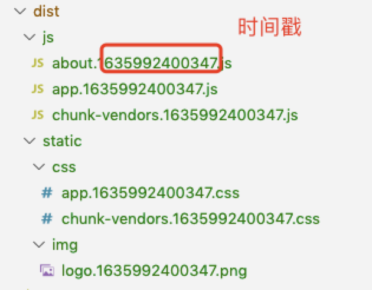

## 为什么需要缓存

#### 优点：
从前端角度来看，缓存可以减少网络请求，减轻服务器压力，使js、css、image等资源更快的加载，从而使页面更快的渲染，提高用户体验。

#### 弊端：
在更新资源后，并且资源包路径名称不修改，将导致页面内容不更新，需要强制刷新或者手动清除缓存才行，用户体验差。例如：css样式、image图片同名替换等...<br>

## 如何解决缓存问题
1. 手动修改资源名称 （每次更改手动跟新，繁琐，不推荐）
2. 在head中配置meta标签 （每次访问都会重新请求，对于没有改动的资源不友好，重复请求，不推荐）
``` html
<meta http-equiv="pragram" content="no-cache">
<meta http-equiv="cache-control" content="no-cache, no-store, must-revalidate">
<meta http-equiv="expires" content="0">
```
3. 为资源添加时间戳 （强烈推荐）<br>
下面将从vue、原声，两方面内容介绍如何规避这种问题，消除我们的烦恼~

## vue配置
#### 打开vue.config.js文件，添加以下配置，分别为css、image、js添加时间戳
```js
const Version = new Date().getTime()

module.exports = {
  css: {
    // 修改打包后css文件名 添加时间戳
    extract: {
      // 此处static/css/xxx 目录根据自己打包情况来定,我使用的就没有static一层,所以直接去掉static即可。根据自己项目决定
      filename: `static/css/[name].${Version}.css`,
      chunkFilename: `static/css/[name].${Version}.css`
    }
  },
  chainWebpack: config => {
    // img的文件名修改 添加时间戳
    config.module
      .rule('images')
      .use('url-loader')
      .tap(options => {
        options.name = `static/img/[name].${Version}.[ext]`
        options.fallback = {
          loader: 'file-loader',
          options: {
            name: `static/img/[name].${Version}.[ext]`
          }
        }
        return options
      })
  },
  configureWebpack: {
    // js添加时间戳 防止缓存
    output: {
      filename: `js/[name].${Version}.js`,
      chunkFilename: `js/[name].${Version}.js`
    }
  }
}
```

#### 打包后的资源
<br/>

## 原生配置

```js
//js 加时间戳
document.write('<script type="text/javascript" src="./js/header.js?t='+ new Date().getTime() +'"><\/script>')
//css 加时间戳
document.write("<link rel=\"stylesheet\" href=\"./css/common.css?t="+ new Date().getTime() +"\" type=\"text/css\" media=\"screen\"/>")
//img 加时间戳
img.src += '?t='+(+new Date().getTime())
```