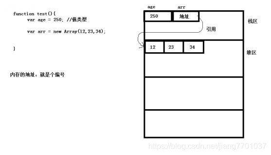
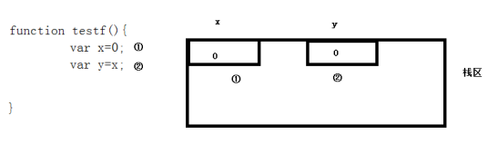
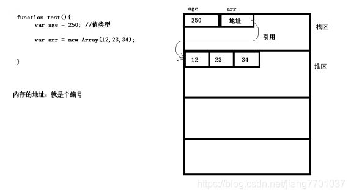
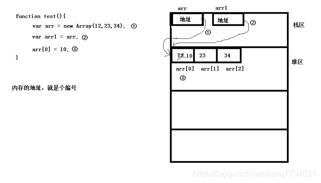
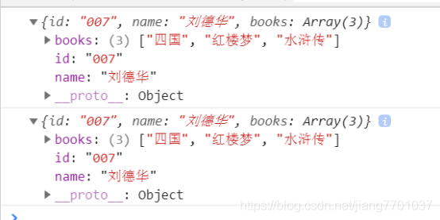
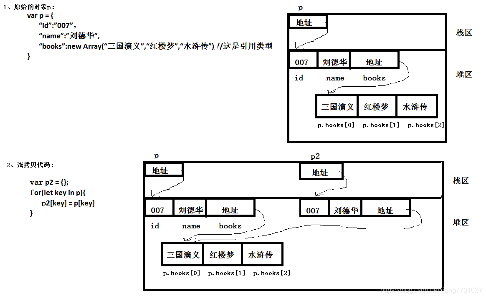
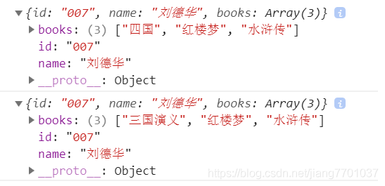
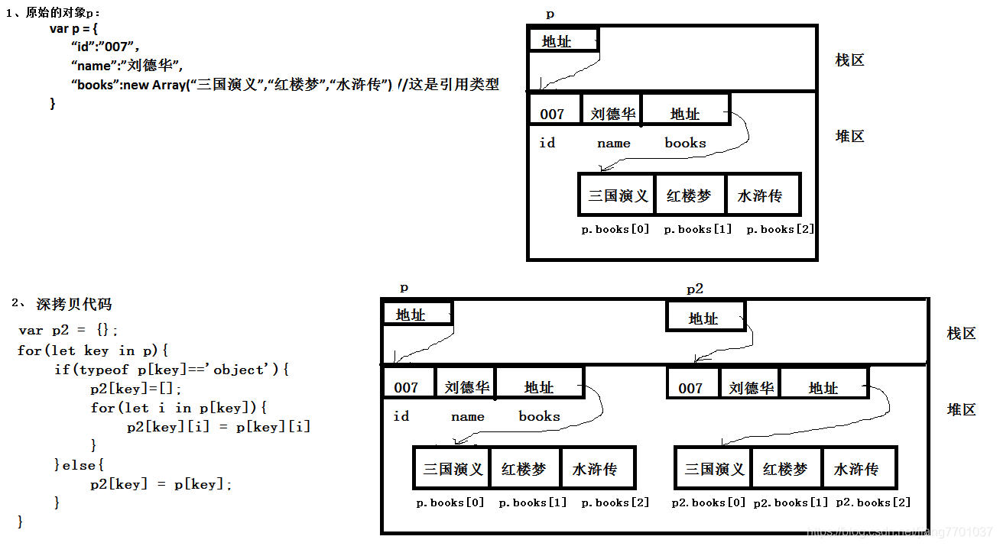
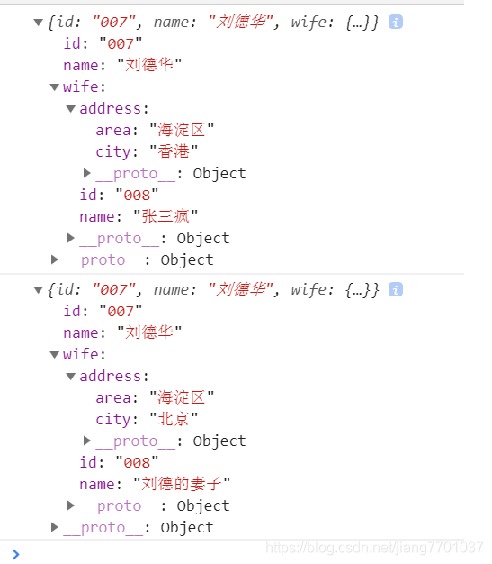

 ## 总结

   浅复制：仅仅是指向被复制的内存地址，如果原地址发生改变，那么浅复制出来的对象也会相应的改变。

   深复制：在计算机中开辟一块新的内存地址用于存放复制的对象。
 ## 首先了解内存

 进入正题, 内存分为四个区域：栈区（堆栈），堆区，全局静态区，只读区（常量区和代码区）。

  ## 一丶基本类型和引用类型在内存上存储的区别?
  
  

  以上函数test在调用时:

  1、 定义局部变量 age，由于age是局部变量，所以在栈中申请内存空间，起名为age，又由于给age赋的值250是基本类型，所以，值直接存储在栈中。

  2、定义局部变量arr，由于arr是局部变量，所以在栈中申请空间，但是arr的内存中存储的是什么？由于给arr赋的值不是基本类型，而是引用类型（new出来的），所以，先在堆中申请空间存放数据 12,23,34,。再把堆区的地址赋给arr。
 
  ## 二丶基本类型和引用类型在赋值时内存的变化?

  1、基本类型：

  

  2、引用类型：

  

  如果在上面的基础上增加一句代码：arr[0]=10;那么内存将会有如下变化：

  

  ## 三丶深拷贝和浅拷贝：

  终于说到了深拷贝和浅拷贝了.

  其实在第一点已经说到了拷贝，所谓拷贝，就是赋值。把一个变量赋给另外一个变量，就是把变量的内容进行拷贝。把一个对象的值赋给另外一个对象，就是把一个对象拷贝一份。

  1.基本类赋值没有问题

因为，基本类型赋值时，赋的是数据不是地址,所以，不存在深拷贝和浅拷贝的问题。

如:
    var a = 100;

    var b = a;

    b = 200;

    console.log(a,b);//100,200

如果要改变b的值，a的值不会改变。

  2.引用类赋值有问题

因为，引用类型赋值时，赋的值地址（就是引用类型变量在内存中保存的内容）

如：

    var arr1 = new Array(12,23,34)

    Var arr2 = arr1;//这就是一个最简单的浅拷贝

如果要改变arr2所引用的数据：arr2[0]=100时，那么arr1[0]的值也是100。

原因就是 arr1和arr2引用了同一块内存区域（以上的第二点中有体现）。

这是最简单的浅拷贝，因为，只是把arr1的地址拷贝的一份给了arr2，并没有把arr1的数据拷贝一份。
所以，拷贝的深度不够

  3.演示深浅拷贝

    (1).浅拷贝
    var p2 = {};
    for(let key in p){
        p2[key] = p[key];	
    }
    p2.books[0] ="四国";
    console.log(p2);
    console.log(p);

在控制台中打印的结果（只有p2的books[0]变成了“四国”）

  

  内存:

  

  (2).深拷贝

        var p2 = {};
        for(let key in p){
            if(typeof p[key]=='object'){
                p2[key]=[];//因为,我上面写的是数组,所以,暂时赋值一个空数组.
                for(let i in p[key]){
                    p2[key][i] = p[key][i]
                }
            }else{
                p2[key] = p[key];
            }
        }
        p2.books[0] ="四国";
        console.log(p2);
        console.log(p);

在控制台中打印的结果（只有p2的books[0]变成了“四国”）

  

内存:

  

  (3).深拷贝优化

  如果拷贝的属性都是对象,属性的属性也是引用类型,即层层嵌套很多,那么用递归的方式:

        var p = {
        "id":"007",
        "name":"刘德华",
        "wife":{
            "id":"008",
            "name":"刘德的妻子",
            "address":{
                "city":"北京",
                "area":"海淀区"
            }
        }
    }
    
    //写函数
    function copyObj(obj){
        let newObj={};
        for(let key in obj){
            if(typeof obj[key] =='object'){//如:key是wife,引用类型,那就递归
                newObj[key] = copyObj(obj[key])
            }else{//基本类型,直接赋值
                newObj[key] = obj[key];
            }
        }
        return newObj;
    }
    
    let pNew = copyObj(p);
    pNew.wife.name="张三疯";
    pNew.wife.address.city = "香港";
    console.log(pNew);
    console.log(p);

  打印:

  
