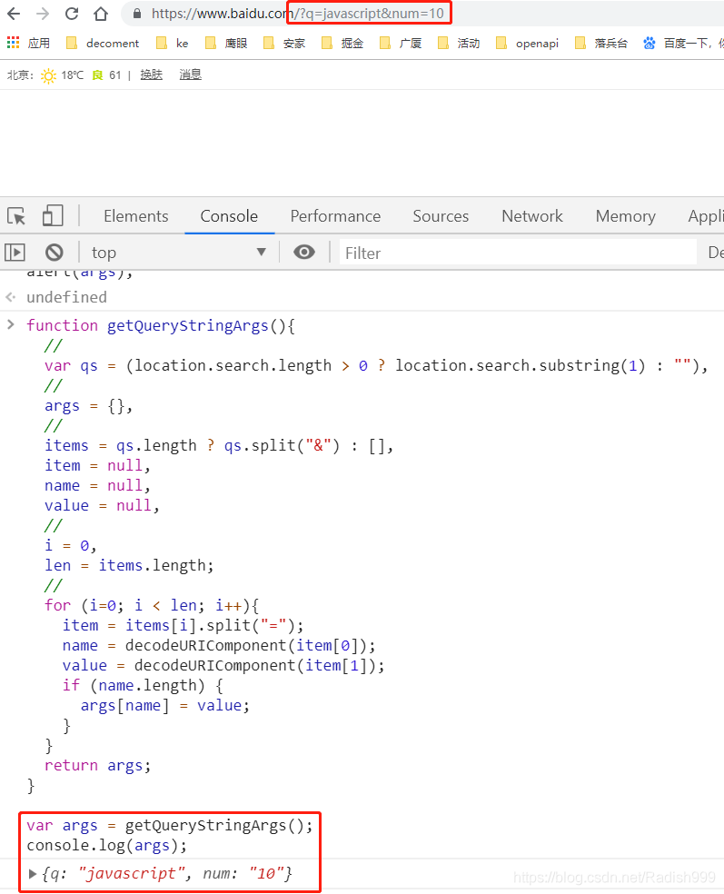

### 1、解析URL 末尾的字符串，然后返回包含所有参数的一个对象
```js
function getQueryStringArgs(){
  //取得查询字符串并去掉开头的问号
  var qs = (location.search.length > 0 ? location.search.substring(1) : ""),
  //保存数据的对象
  args = {},
  //取得每一项
  items = qs.length ? qs.split("&") : [],
  item = null,
  name = null,
  value = null,
  //在 for 循环中使用
  i = 0,
  len = items.length;
  //逐个将每一项添加到 args 对象中
  for (i=0; i < len; i++){
    item = items[i].split("=");
    name = decodeURIComponent(item[0]);
    value = decodeURIComponent(item[1]);
    if (name.length) {
      args[name] = value;
    }
  }
  return args;
}
//假设查询字符串是?q=javascript&num=10
var args = getQueryStringArgs();
alert(args["q"]); // javascript
console.log(args ) // {q: "javascript", num: "10"}
```
步骤解析：

(1)这个函数的第一步是先去掉查询字符串开头的问号。当然，前提是 location.search 中必须要包含一或多个字符。

(2)然后，所有参数将被保存在 args 对象中，该对象以字面量形式创建。

(3)接下来，根据和号（&）来分割查询字符串，并返回 name=value 格式的字符串数组。

(4)下面的 for 循环会迭代这个数组，然后再根据等于号分割每一项，从而返回第一项为参数名，第二项为参数值的数组。再使用 decodeURIComponent()分别解码 name 和 value（因为查询字符串应该是被编码过的）。

(5)最后，将 name 作为 args 对象的属性，将 value 作为相应属性的值。

示例如下：

<br/>

