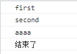

# 根据id从树形结构中查找出对象

```js
// list:树形结构数据, 
// orgId:要查找的orgId条件
// 返回值：查找的对象
checkOrg(list, orgId) {
      let org1 = null
      if (!list) return // return; 中断执行
      for (let i in list) {
        if (org1 !== null) break
        let item = list[i];
        if (item.id === orgId) {
          org1 = item;
          break;
        } else if (item.children && item.children.length) {
          org1 = this.checkOrg(item.children, orgId);
        }
      }
      return org1
 },
```

###### 附： forEach结束循环方法

```js
try {
      var array = ["first", "second", "third", "fourth"];
      array.forEach(function (item, index) {
        if (item == "third") {
          var a = 'aaaa'; // first second 后就报错，就跳出循环了
          console.log(a)
          throw new Error("ending"); //报错，就跳出循环
        } else {
          console.log(item);
        }
      })
    } catch (e) {
      if (e.message == "ending") {
        console.log("结束了");
      } else {
        console.log(e.message);
      }
    }
```

运行结果：
<br/>

