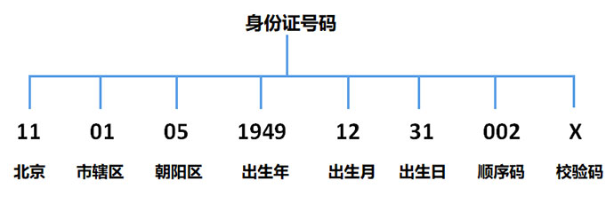

# 身份证号正则判断详解

### 1.1 前言


根据现行《中华人民共和国居民身份证法》2011修正版之规定，一代居民身份证（15位）已于2013年1月1日起停止使用，现行18位的身份证号码称为二代居民身份证。

本文中所指的身份证号码都是指二代身份证号码。

### 1.2 背景知识

#### 1.2.1 身份号码编码规则

根据【中华人民共和国国家标准 GB 11643-1999】中有关公民身份号码的规定，公民身份号码是特征组合码，由十七位数字本体码和一位数字校验码组成。



由上述示例图可知，二代身份证号码是由 【6位地址码，8位出生日期码，3位顺序码，1位校验码】共18位组成。

#### 地址码

表示编码对象常住户口所在县（市，旗，区）的行政代码，按 GB/T 2260的规定执行。

#### 出生日期码

表示编码对象出生的年、月、日，按 GB/T 7408的规定执行。年、月、日代码之间不用分隔符。

#### 顺序码

顺序码是同一地址码所标识的区域范围内，对同年、同月、同日出生的人编定的顺序号，顺序码的奇数分配给男性，偶数分配给女性，即第17位奇数表示男性，偶数表示女性。

#### 校验码

校验码采用 ISO 7064:1983, MOD 11-2 校验字符系统。具体计算校验方式无（自己查吧）。

[国标：GB 11643-1999](http://www.gb688.cn/bzgk/gb/newGbInfo?hcno=080D6FBF2BB468F9007657F26D60013E)

#### 1.2.2 地区码规则

以前的公民身份号码地区码部分并不遵循国标《GB/T 2260》，所以地区码校验只能做简单的省级码（前两位）校验。

##### 省级地址码：

- 华北：北京11，天津12，河北13，山西14，内蒙古15
- 东北： 辽宁21，吉林22，黑龙江23
- 华东： 上海31，江苏32，浙江33，安徽34，福建35，江西36，山东37
- 华中： 河南41，湖北42，湖南43
- 华南： 广东44，广西45，海南46
- 西南： 四川51，贵州52，云南53，西藏54，重庆50
- 西北： 陕西61，甘肃62，青海63，宁夏64，新疆65
- 特别：台湾71，香港81，澳门82

91开头是外国人取得中国身份号码的前两位编码，但上述说法并未得到证实。如有持91开头身份号码请帮忙确认相关信息。

#### 1.2.3 出生日期码规则

出生日期码校验比较简单，只要符合日期的基本格式，月份限投影，天数限制及年龄区间规则即可。

其中年龄区间需要根据特定应用的实际自行设定阈值区间。

##### 例子：

- 20081423 -- 月份错误
- 20080230 -- 日期错误
- 20280203 -- 年份错误

#### 1.2.4 校验码计算规则

有兴趣的自己百度吧~

### 2.1 JavaScript实现

#### 2.1.1 JS校验地区码

省级地址码的JavaScript基本实现代码如下：

```javascript
var checkProv = function (val) {
    var pattern = /^[1-9][0-9]/;
    var provs = {11:"北京",12:"天津",13:"河北",14:"山西",15:"内蒙古",21:"辽宁",22:"吉林",23:"黑龙江 ",31:"上海",32:"江苏",33:"浙江",34:"安徽",35:"福建",36:"江西",37:"山东",41:"河南",42:"湖北 ",43:"湖南",44:"广东",45:"广西",46:"海南",50:"重庆",51:"四川",52:"贵州",53:"云南",54:"西藏 ",61:"陕西",62:"甘肃",63:"青海",64:"宁夏",65:"新疆",71:"台湾",81:"香港",82:"澳门"};
    if(pattern.test(val)) {
        if(provs[val]) {
            return true;
        }
    }
    return false;
}
//输出 true，37是山东
console.log(checkProv(37));
//输出 false，16不存在
console.log(checkProv(16));
```

可根据实际应用需要修改上述程序实现代码。

#### 2.1.2 JS校验出生日期

出生日期码的JavaScript基本实现代码如下：

```javascript
var checkDate = function (val) {
    var pattern = /^(18|19|20)\d{2}((0[1-9])|(1[0-2]))(([0-2][1-9])|10|20|30|31)$/;
    if(pattern.test(val)) {
        var year = val.substring(0, 4);
        var month = val.substring(4, 6);
        var date = val.substring(6, 8);
        var date2 = new Date(year+"-"+month+"-"+date);
        if(date2 && date2.getMonth() == (parseInt(month) - 1)) {
            return true;
        }
    }
    return false;
}
//输出 true
console.log(checkDate("20180212"));
//输出 false 2月没有31日
console.log(checkDate("20180231"));
```

上述代码中年份包括18、19、20开头的年份，大家可根据实际应用需要修改上述程序实现代码。

#### 2.1.3 JS校验校验码

校验码的JavaScript基本实现代码如下：

```javascript
var checkCode = function (val) {
    var p = /^[1-9]\d{5}(18|19|20)\d{2}((0[1-9])|(1[0-2]))(([0-2][1-9])|10|20|30|31)\d{3}[0-9Xx]$/;
    var factor = [ 7, 9, 10, 5, 8, 4, 2, 1, 6, 3, 7, 9, 10, 5, 8, 4, 2 ];
    var parity = [ 1, 0, 'X', 9, 8, 7, 6, 5, 4, 3, 2 ];
    var code = val.substring(17);
    if(p.test(val)) {
        var sum = 0;
        for(var i=0;i<17;i++) {
            sum += val[i]*factor[i];
        }
        if(parity[sum % 11] == code.toUpperCase()) {
            return true;
        }
    }
    return false;
}
// 输出 true， 校验码相符
console.log(checkCode("11010519491231002X"));
// 输出 false， 校验码不符
console.log(checkCode("110105194912310021"));
```

#### 2.1.4 JS完整代码清单

##### 验证函数：

```javascript
var checkID = function (val) {
    if(checkCode(val)) {
        var date = val.substring(6,14);
        if(checkDate(date)) {
            if(checkProv(val.substring(0,2))) {
                return true;
            }
        }
    }
    return false;
}
//输出 true
console.log(checkID("11010519491231002X"));
//输出 false，校验码不符
console.log(checkID("110105194912310021"));
//输出 false，日期码不符
console.log(checkID("110105194902310026"));
//输出 false，地区码不符
console.log(checkID("160105194912310029"));
```


