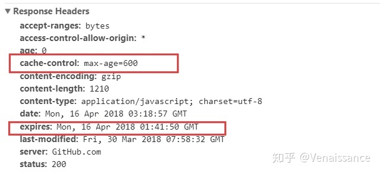
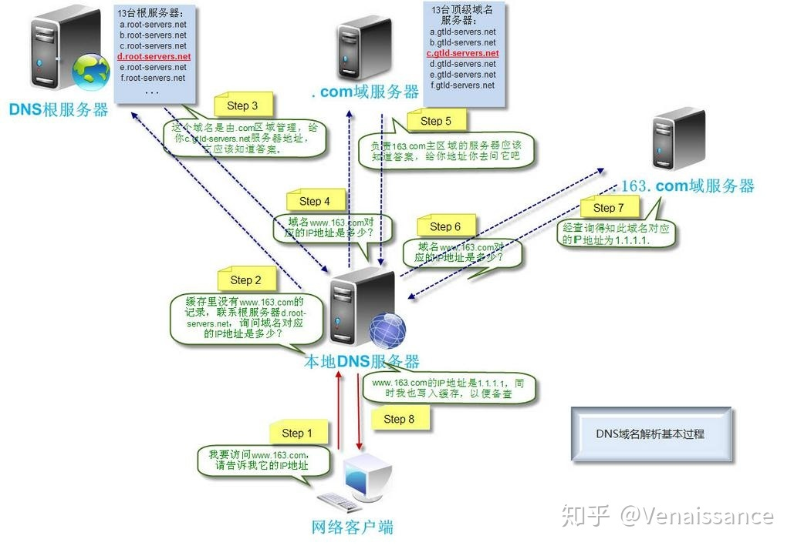
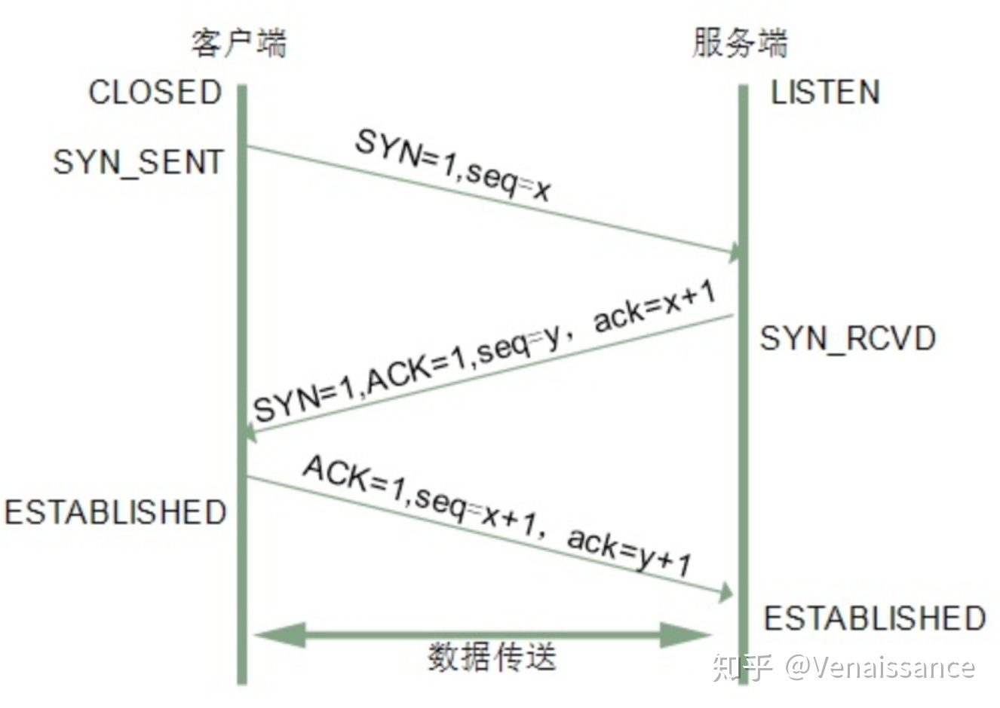

# 1 浏览器  

## 1.1 浏览器进程    
ui线程 控制浏览器上的按钮输入框等
网络线程 负责资源的下载
储存线程 负责本地缓存的访问
## 1.2 渲染进程
js引擎          负责执行js，所以js是单线程
gui渲染线程     负责渲染资源，和js引擎互斥
事件触发线程     所有的事件都会被推入事件栈
异步请求线程     处理请求和异步函数，通过回调来通知时间的触发进程
定时器线程       处理定时器，这也就是说为什么有微宏任务，能分的这么详细的原因
## 1.3 cpu进程
第三方插件进程，安装的浏览器插件
# 2 构建请求
接到url变化，然后看转发给网络线程，构建请求，在然后开始请求
# 3 查找强缓存
## 3.1 强缓存
1:exprires绝对失效时间，标准时间格式，这个是本地时间做对比，用户可手动修改本地时间
2:cacge-control：缓存多少秒过期，相对时间

## 3.2 强缓存的优先级
如果**exprires和cacge-control同时存在 那么优先读取cacge-control的缓存**

# 4 DNS解析
DNS解析出当前域名的真实ip

## 4.1 解析8步
1：输入网址（域名），告诉要找到他的ip
2：先去本地查找混存，询问域名对应的id，如果有没有的话，就去第三步
3：去dns跟服务找到这个域名，在返回本地的dns服务器询问ip
4：本地dns在去转发到.com的根域名服务去查找ip
5：根域名在给你返回一个你要访问的地址
6：你带着命令去找访问地址问他这个域名的ip
7：你访问的那个服务器给你ip
8：本地dns服务器得到域名的ip 然后写入缓存，下次就只在本地dns去查找

# 5 建立tcp连接
 知道服务器的 IP 地址后，就可以跟服务器正式建立连接了，所以需要跟服务器建立 TCP 连接。通过三次握手。三次握手的流程如下图所示。

 

 ## 5.1 为啥要三次握手
 是因为浏览器和服务器都需要确认对方有正常的收发能力。如果两次握手的话，客户端能知道服务端能收能发，但服务端只能知道客户端能发送数据，并不知道客户端接受数据是没问题的----个人理解
   第一次 前端：我要向后端一决生死 ；
   第二次：后端：来啊，我就在这，你来啊；
   第三次：前端：你tm等着看我不捅死你；-----握手完毕
  # 6 发送请求，收到相应
  前端：发送的请求头，请求体，url，http协议发过去
  后端：http协议，状态码，响应头，响应体。
  # 7 找协商缓存
   前端得到响应码304，就会去找本地的缓存
    disk cacne 存咋磁盘中，下次进来的时候直接缓存中去取效率慢，到那时内存大，时间长
    memory cache 存在浏览器的内存中，效率快，时间没有disk cache时间长

    协商缓存  Etag 收到的是标识符，修改了一点，但是没必要完全下载资源变化时间小于1秒
             Last-Modified收到的是最后修改时间   e-tag的优先级大于last-Modified
  # 8 断开tcp链接
  1：第一次客户端说要关闭了，
  2：服务端好嘞，我也关，
 3：服务端，你等等我把剩下的发完
 4：客户端，ok我去渲染完，我也关了
 为什么要有四次挥手，握手就三次呢 如果没有第三步，是不是就拿不到服务端还没发送完的数据导致数据丢失
 ## 9 解析HTML 构建dom树
 ## 10 样式计算构建cssdom树
 ## 11 布局
 ## 12 生成图层树
 ## 13 绘制
 ## 14 合成于显示
 # 渲染流程
 1：渲染进程将HTML内容转化为能够读懂的DOM书结构

 2：渲染引擎将Css样式转化为浏览器可以理解的styleSheets，计算成cssdom树

 3：创建布局树，并计算元素布局信息

 4：对每个布局书进行分层，并生成图层树

 5：为每个图层生成绘制列表，并将其提交到合成线程

 6：合成线程将土城分成图款，并在栅格化线程池中将图块转化成位图

 7：合成线程搞定的时候发送命令给DrawQuad给浏览器进程

 8：浏览器根根据合成线程发过来的信息生成页面，并且显示到显示器上

