## 为什么要用nuxt

加载更快，更好的seo，乌拉乌拉乌拉，我放俩连接，看一下

[ssr的](https://www.zxcaedu.com/#/)

[普通官网](https://www.jytqedu.com/)

在看打一下ssr打包之后的文件，和vue打包之后的不同
* ssr静态打包之后index.html
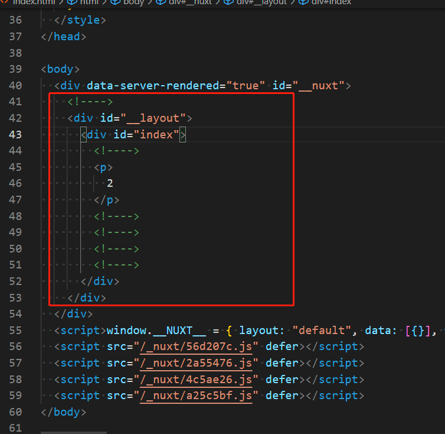 

* vue打包之后index.html 

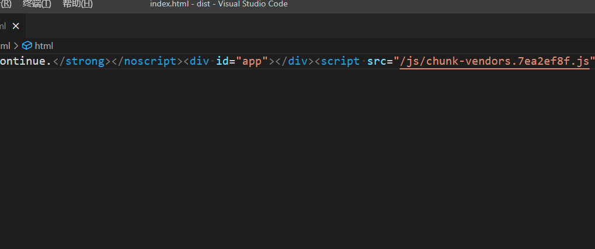

* ssr打包之后呢，你的那些dom元素都会预渲染出来，只是把css和dom树合并一下就完事
* vue打包就只是一个标签，然后再从新去走渲染流程

## 安装

[安装教程](https://www.nuxtjs.cn/guide/installation)

## 路由

* vue里新建路由 这就不放图了，大家应该都知道
* nuxt也不用放图，直接在pages页面下创建.vue后缀的页面，他会自己给你加上去到.nuxt下router.js就能看到你创建的路由了

## dom还是虚拟dom没变化
* 证实一下哈 我混入一个指令来看dom
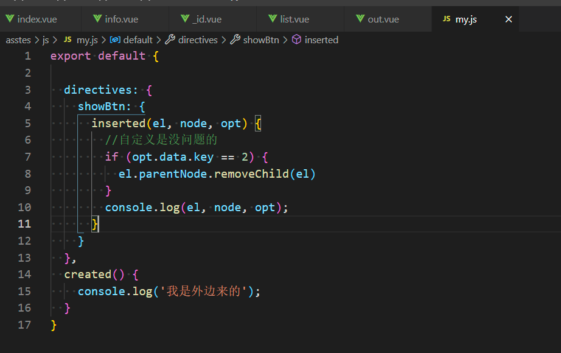
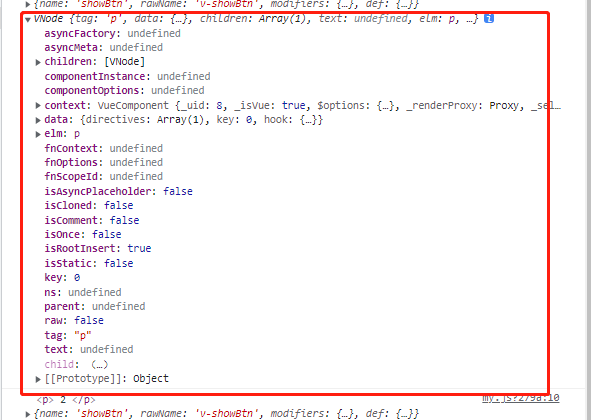

且可以看到，只是在打包的时候就像博客一样，个人理解他重新生成了一个html的静态文件 我写这个项目暂时没遇到过vue里能用，nuxt里不能用的(动态组件除外)

## 目录结构

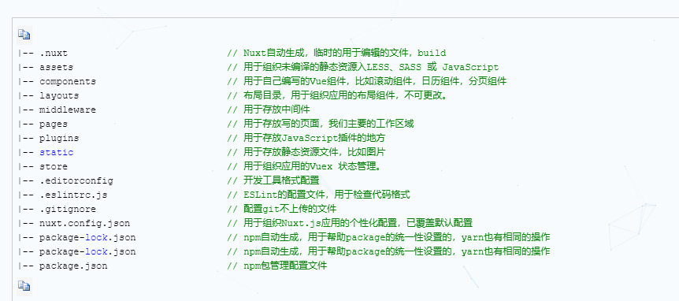

* /note/note/assets这个里边放的资源会被vue-loader优化 别的就如图了
## package.json的几个命令
* 别的和vue是一样的，但是需要注意的是他静态资源打包的时候，nuxt build 和 nuxt generate打包是有区别的
* 我只是简单的了解了一下，有兴趣的自行百度哈
* nuxt generate 正儿八经的静态，打个比方后台给个商品列表，你打包的时候是1,2,3,4,5 过几天后台给你了5,4,3,2,1 正常来说咱们前端不用处理，但是如果你用了nuxt generate这个命令去打包， 那你就要在重新打一次包（不知道为啥，别问，我自己也试了一次，的确是这样）所以nuxt generate只适合做一些纯静态的页面例如官网！！！！！
* nuxt build打包生成的是动态页面，当然是同样具有SEO功能。别的呜啦啦啦百度吧
* 还有个 nuxt start 是说挂个什么东西服务PM2是JavaScript运行时Node.js的进程管理器。 允许一直保持应用程序活跃，无需停机即可重新加载它们，并促进常见的Devops任务。(不知道干嘛的。我百度的)
## nuxt.config.js
* 公用配置文件，打包文件

### 页面公用配置

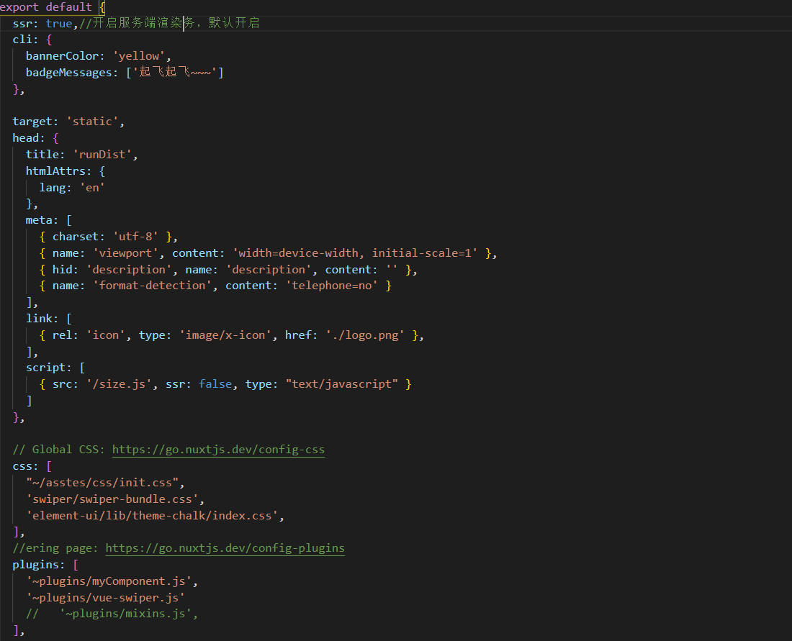

### 当前页面配置
* 在当前页面的head属性中可以引入当前页面需要的文件添加你想要的配置
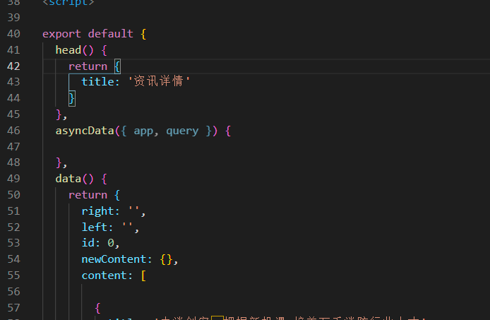
### 引入插件
* 看到配置项有个plugins 数组 他就是来配置我们引入的各种插件。
* 官网的话是这样说
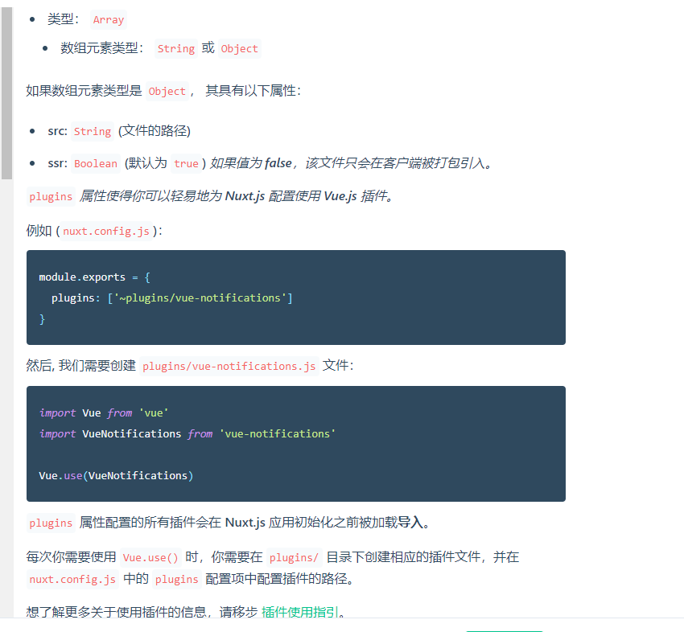
* 我是这么写 拿swiper举例要写在这个文件夹下，然后再nuxt.config.js里的plugins引入这样就能达到全局引入
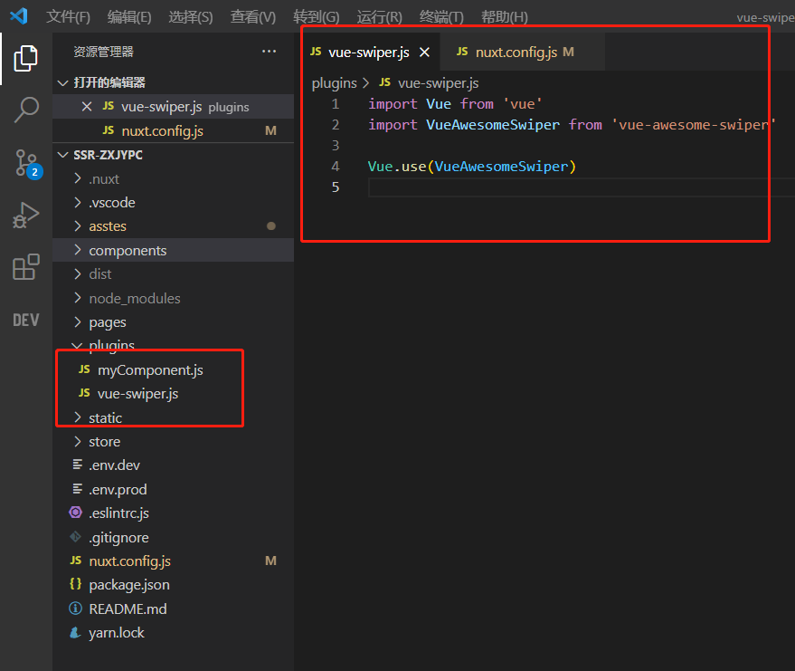
* 局部引用 拿element举例哈（踩坑项哈。单独引入element某个组件的时候要去lib文件夹下去找对应js文件）
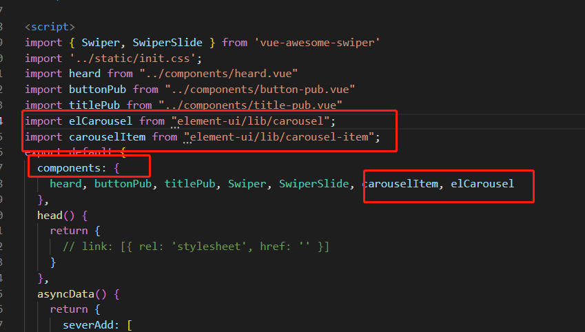
然后就可以愉快的打包了！打包你就GG 不然你打个试试，你所有的静态资源会找不到，你asstes文件下的文件 找不到，static文件也找到，页面也跳不了，所以哈，就有了下边的配置项
### 打包配置
其实就是正常的webpack的配置 关于asstes下被转译的文件找不到添加如下配置 添加完再去试一次哈
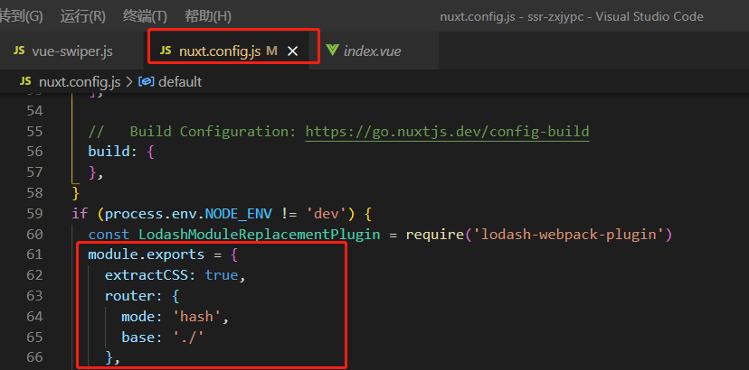
* 解决完打包路径问题之后，剩下的webpack配置就看你自己需求加了，提示一点 nuxt里边自带了很多常见loader 如果不是有特别的需求loader不变，去加插件吧 nuxt打包完之后如果代码块大于100k 他会提示你，并且告诉你不利于ssr 在build里添加analyze:true来查看打包文件的大小，去进行优化。
## 书写注意
vue的生命周期还是都支持的额外新增了一个asyncData 官网的说法是 asyncData会在组件（限于页面组件）每次加载之前被调用。它可以在服务端或路由更新之前被调用。在这个方法被调用的时候，第一个参数被设定为当前页面的上下文对象，你可以利用 asyncData方法来获取数据并返回给当前组件。他是在组件初始化之前调用的，所以在方法内部是没办法通过this来获取组件的实例 如果你是纯静态打包，那就可以忽略这项，如果你是build打包，还是要注意下的，他和data的区别 asyncData 请求写法
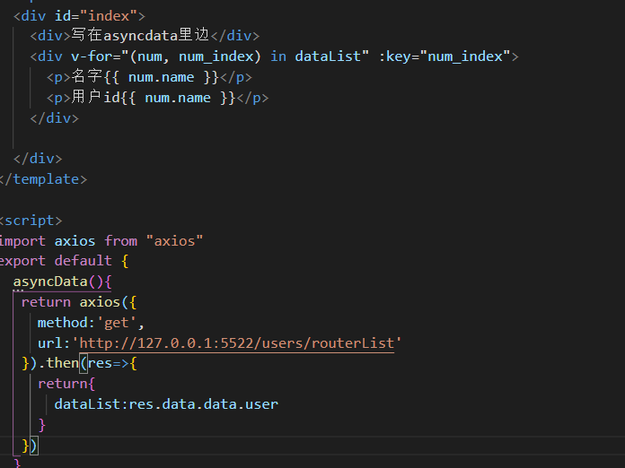
* 放在asyncData 请求打完包之后
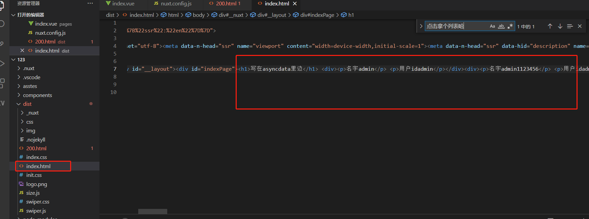
如果那些要做seo的就放在asyncdata里
* 放在methods里的方法打包之后

这种打包后，会请求你的数据，看得到是返回的内容 所以嘞，nuxt generate的打包只适合存静态的打包，后台数据变更，前端要从新打包

