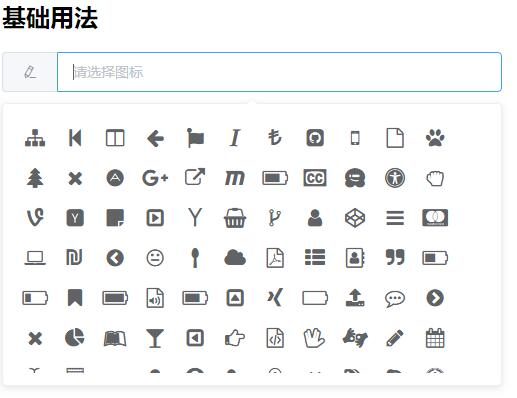
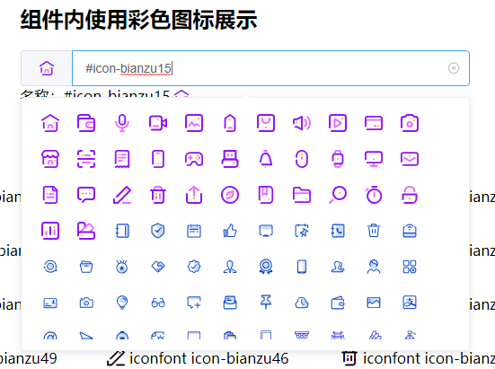
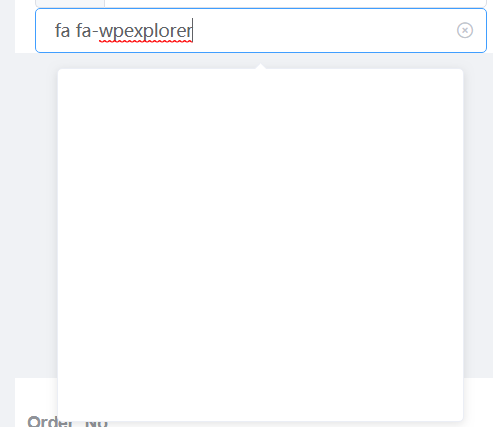
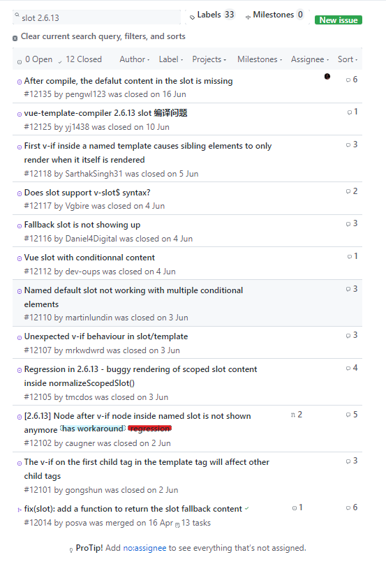

---
tags:
 - e-icon-picker
sidebar: auto
---
# 介绍
##  基础用法展示
<br/>

##  使用彩色图标展示
<br/>

# 入门
##  安装
###  npm安装
```
npm install e-icon-picker -S
```
###  cdn引入
```
<!-- 引入组件库 -->
https://unpkg.com/e-icon-picker@latest
<!-- 引入样式 -->
https://unpkg.com/e-icon-picker@latest/lib/index.css

<!-- font-awesome图标样式 -->
https://unpkg.zhimg.com/font-awesome/css/font-awesome.min.css

<!-- element-ui图标样式 -->
https://unpkg.com/element-ui/lib/theme-chalk/icon.css

<!-- 默认彩色图标样式 -->
https://unpkg.com/e-icon-picker@latest/lib/symbol.js

```
###  全局注册
在引入组件时，可以传入一个全局配置对象，该配置对象目前支持FontAwesome、ElementUI、eIcon、eIconSymbol、addIconList和removeIconList，FontAwesome、ElementUI和eIcon可选值有true和false，表示是否使用该组件图标。 eIconSymbol可选值有true和false，表示eIcon图标是否为彩色图标。 addIconList是自定义新增图标名称的数组，removeIconList则是自定义删除图标名称的数组。

在main.js中加入：
```
import eIconPicker from 'e-icon-picker';
import "e-icon-picker/lib/symbol.js"; //基本彩色图标库
import 'e-icon-picker/lib/index.css'; // 基本样式，包含基本图标
import 'font-awesome/css/font-awesome.min.css'; //font-awesome 图标库
import 'element-ui/lib/theme-chalk/icon.css'; //element-ui 图标库

//全局删除增加图标
Vue.use(eIconPicker, {
    FontAwesome: true,
    ElementUI: true,
    eIcon: true,//自带的图标，来自阿里妈妈
    eIconSymbol: true,//是否开启彩色图标
    addIconList: [],
    removeIconList: [],
    zIndex: 3100//选择器弹层的最低层,全局配置
});
```

### 局部注册
引入e-icon-picker组件
```
import {EIconPicker} from 'e-icon-picker';
```
在组件components中声明
```
export default {
    name: 'app',
    components: {EIconPicker},
    data() {
        return {
            icon: '',
            options: {
                FontAwesome: false,
                ElementUI: false,
                eIcon: true,//自带的图标，来自阿里妈妈
                eIconSymbol: true,//是否开启彩色图标
                addIconList: [],
                removeIconList: []
            }
        }
    }
}
```
在局部样式中引入css

```
<style lang="css" scoped>
@import '~e-icon-picker/lib/index.css';
@import '~font-awesome/css/font-awesome.min.css';
@import '~element-ui/lib/theme-chalk/icon.css';
</style>
```

因为EIconPicker中已经局部注册EIcon了，所以使用时不用再特别注册，但如果在EIconPicker组件外使用EIcon，则需要另外注册。

引入e-icon-picker组件
```
import {EIcon} from 'e-icon-picker';
```
在组件components中声明
```
export default {
    name: 'app',
    components: {EIcon}
}
```
#### 使用
```
<e-icon-picker v-model="icon" :options="options"/>
```
#### 显示图标
```
<e-icon :icon-name="icon"/>
```
# 常见问题
##  图标列表不显示，但是可以点击
<br/>

这个bug首先在vue-element-admin中发现，这个问题的主要原因是vue的2.6.13以前的版本和2.6.13以及2.6.14版本之间的问题，vue也没给出解决的办法。

<br/>

这个问题最简单的办法就是把你的vue版本和vue-template-compiler版本升级到2.6.14；如果你不能去升级你的vue版本，那么这里给出一个其他的解决办法，就是通过以下的方式去使用组件：
```
<e-icon-picker>
    <template #prepend="{icon}">
      <e-icon :icon-name="icon" class="e-icon" />
    </template>
    <template #icon="{icon}">
      <e-icon :icon-name="icon" class="e-icon" />
    </template>
</e-icon-picker>

<style>
.e-icon {
  font-size: 16px;
}
</style>
```
但这个方式会造成组件样式变化，需要用户自己调整

# 组件

### 属性

| 参数                    | 说明                                            | 默认值                                                       | 可选值                  |
| ------------------- | -------------------------------------------- | ------------------------------------------------------------ | ----------------------- |
| value / v-model        | 绑定值                                           |              空                                                                 | —                       |
| disabled               | 是否禁用                                                | false                                                        | true/false              |
| size                   | 组件大小                                     | medium                                                       | large/medium/small/mini |
| width                  | 组件宽度                                     | -1                                                           | number                  |
| readonly               | 原生属性，是否只读                           | false                                                        | true/false              |
| defaultIcon            | 默认图标                                     | eiconfont e-icon-bi                                          | 图标名                  |
| clearable              | 是否可清空                                   | true                                                         | true/false              |
| placement              | 弹窗位置                                     | bottom                                                       | top/bottom              |
| placeholder            | 输入框提示信息                               | 请选择图标                                                   | 任意                    |
| styles                 | 组件自定义样式                               | 空                                                           | 无                      |
| emptyText              | 图标列表为空时默认显示的文本                 | 暂无可选图标                                                 | 任意                    |
| highLightColor         | 图标选中高亮（对svg图标无效）                | 空                                                           | 任意（hex）             |
| zIndex                 | 显示的弹窗层数（会全局影响）                 | 空                                                           | 数字                    |
| options                | 图标参数                                     | {FontAwesome: true, ElementUI: true, addIconList: [], removeIconList: []} | 无                      |
| options.FontAwesome    | 是否使用FontAwesome图标                      | true                                                         | true/false              |
| options.ElementUI      | 是否使用ElementUI图标                        | true                                                         | true/false              |
| options.eIcon          | 自带彩色图标                                 | true                                                         | true/false              |
| options.eIconSymbol    | 是否使用彩色图标（false：则eIcon图标为单色） | true                                                         | true/false              |
| options.addIconList    | 自定义新增图标列表                           | []                                                           | 无                      |

### 事件
| 事件名称     | 说明               | 回调参数   |
| --------    | ------------------ | ---------- |
| change      | 数值发生改变时回调 | 新状态的值 |

### 方法

| 方法名          | 说明                       | 参数           |
| --------------- | -------------------------- | -------------- |
| addIcon         | 添加一个或多个图标         | String / Array |
| removeIcon      | 删除一个或多个图标         | String / Array |
| destroyIconList | 销毁图标列表，不销毁输入框 | -              |
| createIconList  | 重新创建图标列表           | -              |

