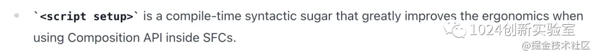

# Vue3.2

## 第一个：`<script setup>`

  `从一开始学习vue3就注意到了实验性的<script setup>。因为简洁的写法受到许多人追捧（写过setup(){return{}} 的人都知道），甚至有人说这才是vue3的完全形态。看了更新描述，emmm....官方吐槽最为致命。
  `
  <br/>
  `
  <script setup> 是一种编译时语法糖，可在 SFC 内使用 Composition API 时**极大地改善工作效率。
  `
  ## 第二个：`新增<style> v-bind`
  `
  而<style> v-bind呢，简单地来说就是可以在内使用组件定义的动态值。官方给出了例子：
  `
  ```
import { ref } from 'vue'
const color = ref('red')
</script>

<template>
  <button @click="color = color === 'red' ? 'green' : 'red'">
    Color is: {{ color }}
  </button>
</template>

<style scoped>
button {
  color: v-bind(color);
}
</style>
  ```
  `
  文档地址：https://v3.vuejs.org/api/sfc-script-setup.html
  `
## 第三个：新增 defineCustomElement方法
Vue 3.2 引入了一个新的 defineCustomElement 方法，可以使用 Vue 组件 API 轻松创建原生自定义元素：
```
import { defineCustomElement } from 'vue'
​
const MyVueElement = defineCustomElement({
  // normal Vue component options here
})
​
// Register the custom element.
// After registration, all `<my-vue-element>` tags
// on the page will be upgraded.
customElements.define('my-vue-element', MyVueElement)

```

## 第四个：性能改进
此处有很大篇幅讲述3.2版本的性能升级，其中提到了新的指令v-memo，简单来说这个指令会记住模板树的一部分，不仅跳过虚拟 DOM 差异，而且完全跳过新 VNode 的创建。可用于复杂的大型页面。

## 第五个：服务器渲染
最后提到了服务端渲染与新的Effect Scope API。

## 第6个：1024Lab 再说点儿


defineProps、defineEmits、defineExpose、withDefaults属于compiler macro，编译器宏。文档中也说到：<br/>
They do not need to be imported, and are compiled away when is processed

他们不需要引入，会在编译的时候处理掉。<br/>
然而不引入你用的时候就会报错。
```
<script setup lang="ts">
const props = defineProps<{
  value?: number;
}>();
​
const emit = defineEmits<{
  (e: 'update:value', value: number): void;
}>();
</script>

```
首先eslint会报错：
`ESLint: 'defineEmits' is not defined.(no-undef)`

此时你需要更改eslint-plugin-vue的配置
```
//https://eslint.vuejs.org/user-guide/#compiler-macros-such-as-defineprops-and-defineemits-are-warned-by-no-undef-rule
module.exports = {
  globals: {
    defineProps: "readonly",
    defineEmits: "readonly",
    defineExpose: "readonly",
    withDefaults: "readonly"
  }
}
```

然后可能编译后浏览器控制台会报错
`defineEmits is not defined`

你可能会发现defineEmits等并没有在编译的时候处理掉，通过浏览器看源代码defineEmits还在，且画着红色波浪线。此时你可能需要查看package.json中各个包的版本以及vite的版本2.4.x，更新后重试，此时编译出来的代码应该是这样：

```
const _sfc_main = _defineComponent({
  props: {
    value: { type: Number, required: false }
  },
  emits: ["update:value"],
  setup(__props, { expose, emit }) {}
 })
```