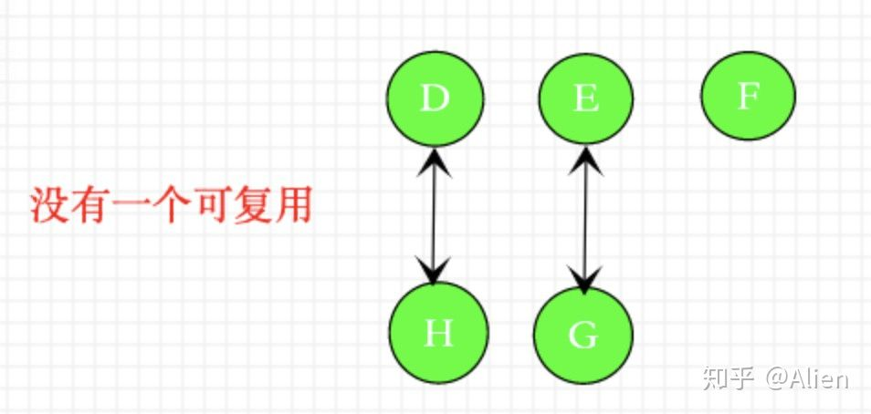

 ## 相比于Vue2.0,Vue3.0做了那些优化?
 1.diff方法优化:

 (1)Vue2.0中虚拟dom是进行全量对比

 如下图:

  

 (2)Vue3.0中新增了静态标记(PatchFlag),在与上次虚拟dom进行对比时,只对比带有patch falg的节点
 并且可以通过flag的x信息得知当前节点要对比的具体内容
 
 如下图:

  
  
  ## 用diff算法进行vode对比

  在vue update过程中在遍历子代vnode的过程中，会用不同的patch方法来patch新老vnode，如果找到对应的 newVnode 和 oldVnode,就可以复用利用里面的真实dom节点。避免了重复创建元素带来的性能开销。毕竟浏览器创造真实的dom，操纵真实的dom，性能代价是昂贵的。

  patch过程中，如果面对当前vnode存在有很多chidren的情况,那么需要分别遍历patch新的children Vnode和老的 children vnode。

  刚说到,哎,我怎么知道这个vnode是newVnode还是oldVnode呢?那下面我们来看一下,

  vue3.0中 在patchChildren方法中有这么一段源码:

    if (patchFlag > 0) {
        if (patchFlag & PatchFlags.KEYED_FRAGMENT) { 
            /* 对于存在key的情况用于diff算法 */
            patchKeyedChildren(
            c1 as VNode[],
            c2 as VNodeArrayChildren,
            container,
            anchor,
            parentComponent,
            parentSuspense,
            isSVG,
            optimized
            )
            return
        } else if (patchFlag & PatchFlags.UNKEYED_FRAGMENT) {
            /* 对于不存在key的情况,直接patch  */
            patchUnkeyedChildren( 
            c1 as VNode[],
            c2 as VNodeArrayChildren,
            container,
            anchor,
            parentComponent,
            parentSuspense,
            isSVG,
            optimized
            )
            return
        }
        }

patchChildren根据是否存在key进行真正的diff或者直接patch。
   
## diff算法作用？

通过前言我们知道，存在这children的情况的vnode，需要通过patchChildren遍历children依次进行patch操作，如果在patch期间，再发现存在vnode情况，那么会递归的方式依次向下patch，那么找到与新的vnode对应的vnode显的如此重要。

我们用两幅图来向大家展示vnode变化。

  

  

如上两幅图表示在一次更新中新老dom树变化情况。

假设不存在diff算法，依次按照先后顺序patch会发生什么。

如果不存在diff算法，而是直接patchchildren 就会出现如下图的逻辑。

  

  第一次patchChidren

  
  
  第二次patchChidren

  
  
  第三次patchChidren

  
  
  第四次patchChidren

  

  如果没有用到diff算法，而是依次patch虚拟dom树，那么如上稍微**修改dom顺序**，就会在patch过程中没有一对正确的新老vnode，所以老vnode的节点没有一个可以复用，这样就需要重新创造新的节点，浪费了性能开销，这显然不是我们需要的。

  那么diff算法的作用就来了。

  diff作用就是在patch子vnode过程中，找到与新vnode对应的老vnode，复用真实的dom节点，避免不必要的性能开销

## key值得作用?

在我们上述diff算法中，通过isSameVNodeType方法判断，来判断key是否相等判断新老节点。

isSameVNodeType方法:

    export function isSameVNodeType(n1: VNode, n2: VNode): boolean {
    return n1.type === n2.type && n1.key === n2.key
    }

isSameVNodeType 作用就是判断当前vnode类型 和 vnode的 key是否相等

那么由此我们可以总结出？

在v-for循环中，key的作用是：通过判断newVnode和OldVnode的key是否相等，从而复用与新节点对应的老节点，节约性能的开销。

## 如何正确使用key?

①错误用法 1：用index做key

用index做key的效果实际和没有用diff算法是一样的，为什么这么说呢，下面我就用一幅图来说明：

  

如果所示当我们用index作为key的时候，无论我们怎么样移动删除节点，到了diff算法中都会从头到尾依次patch(图中：所有节点均未有效的复用)

②错误用法2 ：用index拼接其他值作为key。

当已用index拼接其他值作为索引的时候，因为每一个节点都找不到对应的key，导致所有的节点都不能复用,所有的新vnode都需要重新创建。都需要重新create

如图所示。
  
  
③正确用法 ：用唯一值id做key(我们可以用前后端交互的数据源的id为key,但前提是后端必须保证id是唯一值)。

如图所示。每一个节点都做到了复用。起到了diff算法的真正作用。

  

## 总结

Vue3.0diff算法新增了静态标记,从而进行vnode对比,

而Vue2.0是进行全量对比,其余知识点均是拓展