# 关于yarn
##  前言

1.Npm的介绍
Npm 是 Node.js 官方提供的，包管理规范，如：

将所有第三方依赖包放在 node_modules 这个文件目录下，我们在增加，删除，升级依赖也只是更新这个文件下的相关依赖包。
增加 package.json 文件，这个文件中存放本项目及项目的依赖和版本信息，这样我们就可以一目了然的了解本项目用到了什么，都是什么版本的，不用多处寻找。
在使用依赖时，Node 提供的支持是内置的 require 方法，默认会到这个目录下去检索模块，无需手动指定路径。
如此一来，有了 Npm 的加持，实现模块化，工程化的前端项目搭建，稳定了前后端分离的发展思路。

JavaScript 本身只能用来做一些数学和逻辑运算，不提供任何与 I/O（输入/输出）相关的 API，都要靠宿主环境（host）提供，所以它只合适嵌入到更大型的应用程序环境，去调用宿主环境提供的底层 API。

##  Yarn 的介绍
yarn作为项目的包管理工具，快速、安全、可靠。你下载的包将不再重新下载。而且确保在不同系统中可以正常工作。

这里我们看到Yarn官方推荐的三个特点：
```
1.速度快: Yarn 缓存了每个下载过的包，再次使用时无需重复下载。同时它是并行的，因此安装速度更快
2.安全: 在执行代码之前，Yarn 会通过算法校验每个安装包的完整性。
3.可靠: 使用详细、简洁的锁文件格式和明确的安装算法，使 Yarn 能够在不同系统上保证无差异的工作。
```
Yarn 是基于 Npm 的不足之处做出了全新的改版升级，但是我们并不能说 Yarn 的出现会完全取代 Npm，因为目前的 Yarn ，只是完善升级了 Npm，让开发者们有了更好的体验，但截至目前为止，Yarn 并没有实现全部的 Npm 命令及功能。

## 使用 Npm 的缺点

对比 yarn，就会感觉等待 Npm 安装进度条是一个很漫长的过程，可以使用 Npm 在国内的淘宝镜像服务 cnpm，这样速度虽然提升了，安装之后运行时出现各种问题，所以在速度上，yarn 碾压 npm
关于错误提示，yarn 做的更加人性化，使用 npm 时，如果安装某一个依赖发生错误，npm 会继续打印之后的安装日志，开发者很难注意到到底哪里安装报错
在 npm5 之前，npm 安装无法保证版本的一致性，如：“1.0.3”、“～1.0.3”、"^1.0.3"这三个命令分别代表着：安装指定的 1.0.3 版本、安装 1.0.X 中最新的版本、
安装 1.X.X 中最新的版本，给开发者增加极大的学习成本。
yarn 为了解决以上的问题，增加了 yarn.lock 锁文件，这个方案让开发者不必再担心项目中其他成员安装的依赖版本不同。

## Yarn 和 npm 能否同时使用？

yarn 是对 npm 进行了安装和提升，实现了 npm大部分的命令和功能，且二者都遵循 package.json 文件，所以我们也不用担心兼容问题，yarn 完全没有侵入性。二者完全可以同时使用。

## 在项目中如何安装及使用 Yarn
1 安装
yarn 有很多种安装方式，对于不同的系统，我们可以区别安装，推荐大家使用 Npm 去安装，这种方法最方便简洁。
```
 npm i -g yarn
 ```

2 关于使用
在一个新项目中，我们通常按照以下步骤去使用 yarn：

写入生成package.json，确定项目中需要哪些依赖（如果已有该文件跳过本步骤）。      
执行 yarn 初始化项目依赖，生成 yarn.lock 文件。          
通过yarn add 命令添加需要安装的依赖。            
确定想升级某个依赖的最新版本时，使用yarn upgrad命令升级。            

# yarn命令
## yarn命令汇总

| 命令                     | 释义                                   |
| ------------------------ | -------------------------------------- |
| yarn add                 | 添加依赖                               |
| yarn audit               | 对已安装的软件包执行漏洞审核           |
| yarn autoclean           | 从程序包依赖项中清除并删除不必要的文件 |
| yarn bin                 | 显示依赖bin文件夹的位置                |
| yarn cache               | 管理用户目录中的依赖缓存               |
| yarn check               | 验证当前项目中程序包依赖项             |
| yarn config              | 管理依赖配置文件                       |
| yarn create              | 创建Yarn工程                           |
| yarn dedupe              | 删除重复的依赖                         |
| yarn generate-lock-entry | 生成Yarn锁文件                         |
| yarn global              | 在全局安装依赖                         |
| yarn help                | 显示Yarn的帮助信息                     |
| yarn import              | 迁移当前依赖的项目package-lock.json    |
| yarn info                | 显示有关依赖的信息                     |
| yarn init                | 初始化工程并创建package.json文件       |
| yarn install             | 用于安装项目的所有依赖项               |
| yarn licenses            | 列出已安装依赖的许可证及源码url        |
| yarn link                | 链接依赖文件夹                         |
| yarn list                | 列出已安装的依赖                       |
| yarn login               | 存储您在 registry 上的用户名和 email   |
| yarn logout              | 清除你在 registry 上用户名和 email     |
| yarn outdated            | 列出所有依赖项的版本信息               |
| yarn owner               | 展示依赖作者                           |
| yarn pack                | 创建依赖项的压缩gzip                   |
| yarn policies            | 规定整个项目中执行Yarn的版本           |
| yarn publish             | 将依赖发布到npm注册表                  |
| yarn remove              | 删除依赖                               |
| yarn run                 | 运行定义的程序脚本命令                 |
| yarn tag                 | 在依赖上添加，删除或列出标签           |
| yarn team                | 管理组织中的团队，并更改团队成员身份   |
| yarn test                | 运行程序的test命令                     |
| yarn upgrade             | 将指定依赖升级为最新版本               |
| yarn upgrade-interactive | 更新过期依赖的简便方法                 |
| yarn version             | 展示依赖版本信息                       |
| yarn versions            | 展示所有依赖项版本信息                 |
| yarn why                 | 显示有关为什么安装依赖的信息           |
| yarn workspace           | Yarn的工作区信息                       |
| yarn workspaces          | Yarn的所有工作区信息                   |

##  命令详解


###  yarn version

**解释**：用来查看 yarn 的版本信息
**使用场景**：查看当前安装 yarn 的版本
**具体使用：**
使用 `yarn -v` 或者 `yarn -version` 运行结果如下：

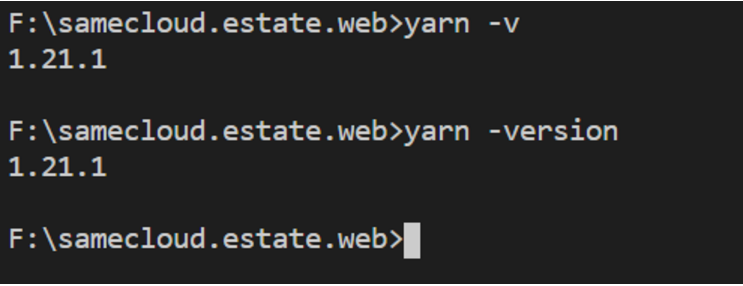<br/>

当安装完 yarn，不知道是否安装成功时，可以使用此命令，如果显示了版本号，说明安装成功。	


###  yarn init

**解释**：初始化项目或者文件夹 

**使用场景**：当你想初始化一个项目，或者文件夹，并生成 `package.json` 文件时，使用此命令。

**具体使用：**
我们初始化一个示例项目，执行：

```
 yarn init
```

​	默认配置项我们直接 enter 默认，运行结果如下：

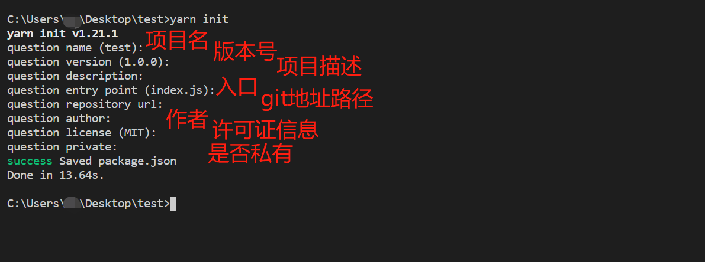<br/>

​	此时，我们就使用 yarn，初始化了一个项目


### yarn add

**解释**：添加一个或者多个依赖
**使用场景**：此命令为 yarn 使用频率最高的几个命令之一，用来添加依赖。
**具体使用：**
依赖添加的具体命令为：

```
 yarn add <package> //如需选择对应版本号，请在依赖后加 @0.x.x

```

比如我们想添加 `gulp-less` 这个依赖，效果如图：

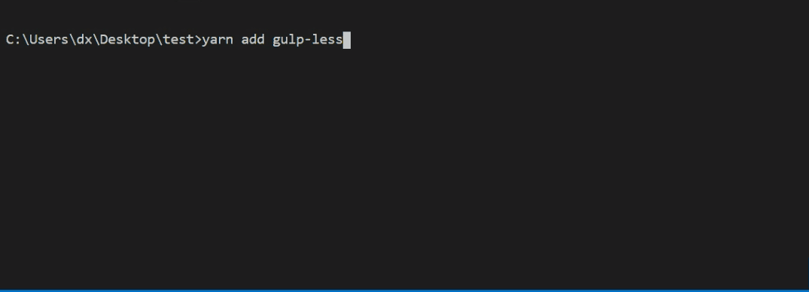<br/>

安装多个依赖后，这个时候 package.json 里面会展示你安装的所有依赖信息：

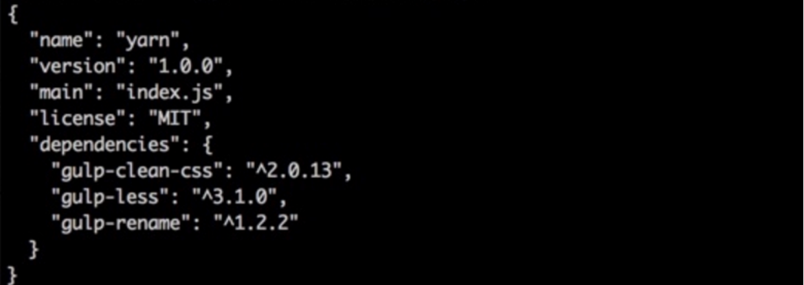<br/>

同样是安装依赖，npm 使用 `npm install` 命令后面接很多参数，如版本号 “~”、"^"等代表的含义都不一样，而`yarn add`就十分简洁，且控制台输出风格更人性化。


### yarn upgrade

**解释**：更新依赖 

**使用场景**：使用此命令可以更新已经安装的依赖。

**具体使用：**
更新某个依赖的具体命令为：

```
 yarn upgrade <package>
```
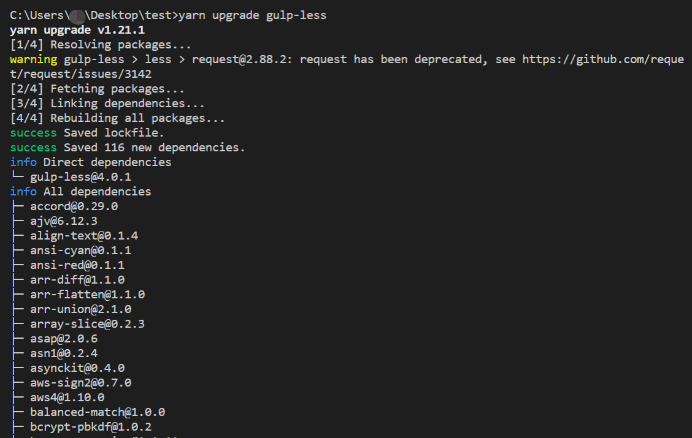<br/>

###  yarn remove

**解释**：删除依赖

**使用场景**：使用此命令可以删除已经安装的依赖。

**具体使用：**
删除某个依赖的具体命令为：

```
 yarn remove <package>
```
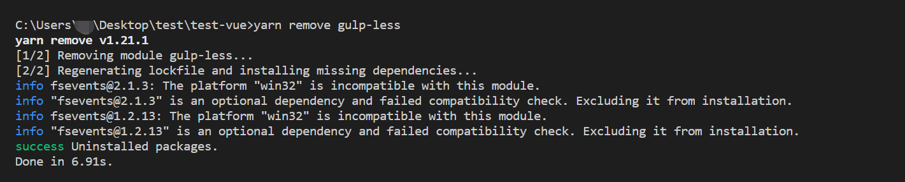<br/>

###  yarn cache

**解释**：用来管理用户缓存的依赖

**使用场景**：当你想查看本地缓存了哪些 Yarn 的依赖，以及具体各个依赖项的详细信息，可以使用该命令

**具体使用：**

- yarn cache dir

运行这个命令会显示出当前缓存目录，默认为 C 盘。例如我的电脑路径是:

```
 C:\Users\**\AppData\Local\Yarn\Cache\v6

```

- yarn cache list

展示所有已缓存的依赖项信息:

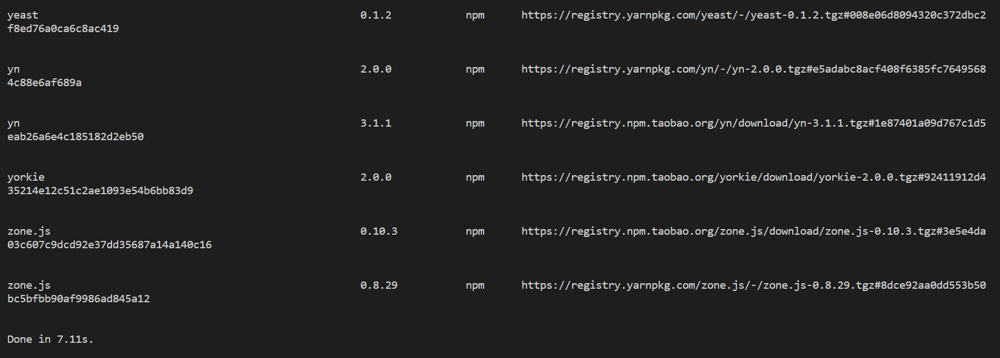<br/>

- yarn cache clean

对本地缓存的依赖进行强制清除

本地有很多项目时，有时会发现用来存放依赖的磁盘空间越来越小，这也许是因为缓存了太多无用的依赖。或者安装依赖时用了很多办法都解决不了的，如依赖版本错误，可以考虑查看并清除本地的依赖缓存。


### yarn config

**解释**：和 npm 的 config 命令类似，用来管理依赖的配置信息

**使用场景**：用来查看和设置依赖的一些配置信息，如资源路径等

**具体使用：**

- yarn config list

这个命令不仅能展示 yarn 的资源路径信息，还能展示 npm 的路径信息：

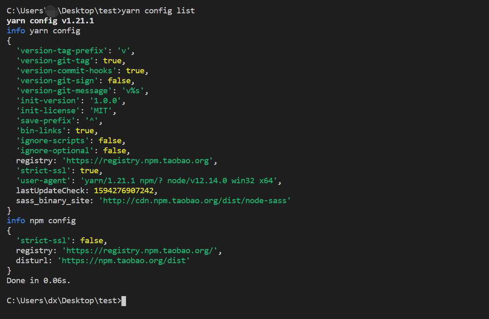<br/>

- yarn cache set

设置配置信息，如设置淘宝镜像地址：

```
 yarn config set registry https://registry.npm.taobao.org

```

对于许多国内开发者来说，有些依赖下载速度慢，再或者直接被墙，这时候我们可以使用本命令来更改资源路径，如改为淘宝镜像，这样就能大大提高开发效率。


###  yarn info

**解释**：查看具体某一个依赖的信息，不一定是本地已经安装过的，远程的也可以

**使用场景**：查看具体的依赖信息

**具体使用：**

- yarn info

例如我们想查看 vue 的具体信息，可以输入命令

```
 yarn info vue

```

这里查看到了所有 vue 这个包的信息，例如作者、版本信息等：
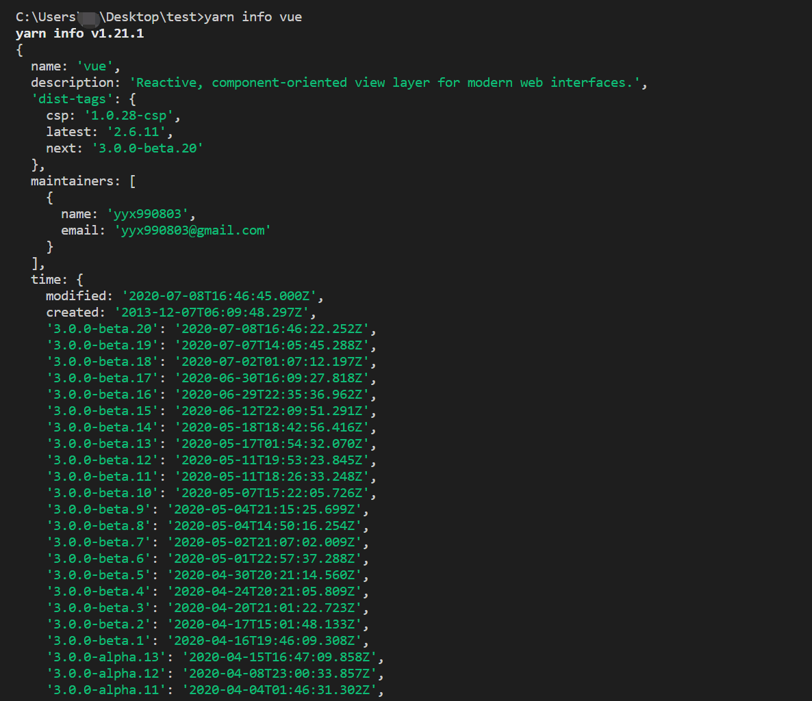<br/>

###  yarn global

**解释**：在 npm 里有 `npm install <package> -g` 的命令，用来全局安装某个依赖，同样yarn也有相对应的全局安装方案 `yarn global`

**使用场景**：使用yarn全局安装某个依赖，或者可以配合`yarn bin`、`yarn remove`等命令使用

**具体使用：**

- yarn global add

例如我们想全局安装 webpack，使用命令：

```
 yarn global add webpack
```
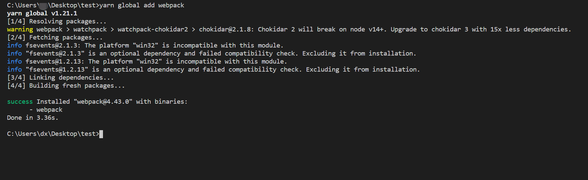<br/>


###  yarn why

**解释**：帮助你寻找本项目的依赖

**使用场景**：想寻找本项目中的某一依赖信息，可以使用该命令。

**具体使用：**

使用命令：

```
 yarn why <package>
```
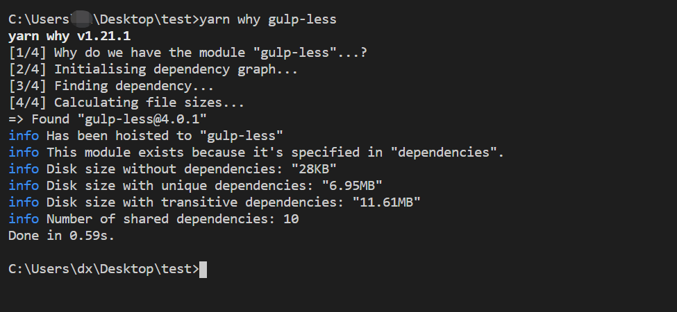<br/>

该命令可以计算依赖大小，及展示该依赖项对应的其他依赖等。


###  yarn run

**解释**：使用 yarn 的`yarn run`命令， 来启动项目相对应的功能。

**使用场景**：在项目里已经定义好相对应的一些命令后，使用 yarn run 命令，来启动项目相对应的功能，本处演示使用 vue cli 初始化得命令。

**具体使用：**

- yarn run <项目定义命令>

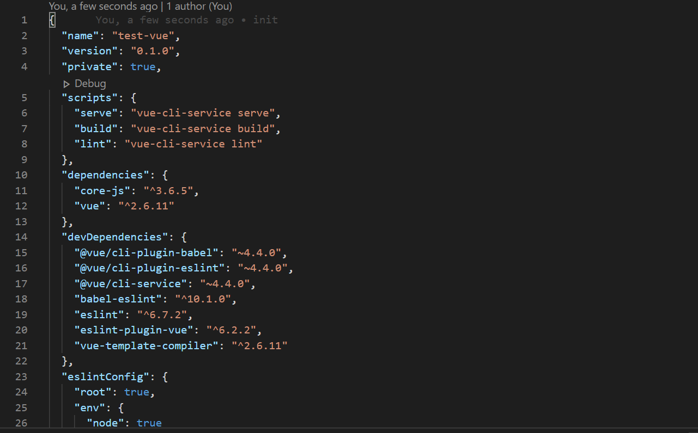<br/>

- 例如：我们使用 `package.json` 文件中定义的启动命令 serve ，如果用npm 我们可以使用`npm serve` 或者 `npm run serve`，在 yarn 命令中，我们使用`yarn run serve` 或者 `yarn serve` 启动项目。

```
yarn run serve
```

运行命令后效果如下图，此时，我们就启动了这个vue-cli默认的项目：

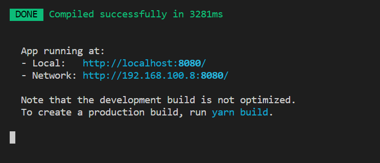<br/>

然后我们再尝试下默认的打包命令：

```
yarn run build
```
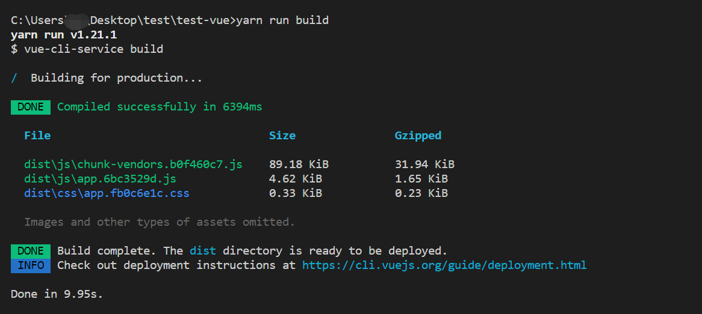<br/>

此时文件夹中的 `dist` 目录便是打包出来的文件。

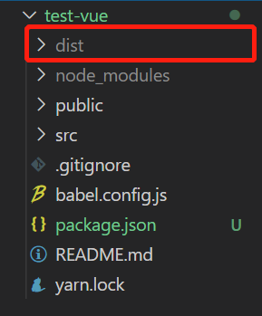<br/>

#  Yarn的工作流示例

## yarn工作流案例示例

###  使用 yarn 初始化一个项目

在这里默认大家已经安装好了yarn，如果没有安装的话，前文有讲过，可以使用多种方式，最简单的方法可以使用npm去安装。

首先第一步，执行下面命令，初始化一个项目：

```
yarn init
```

效果如图
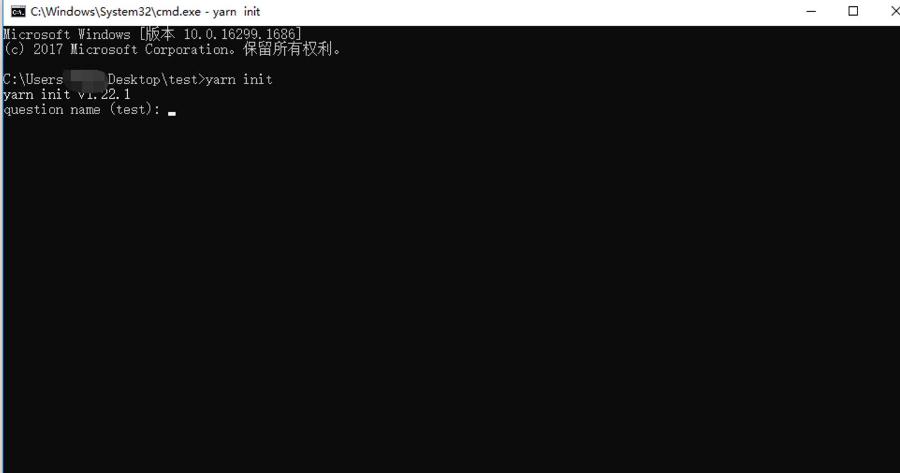<br/>


此时会提示你输入一些问题，方便初始化项目信息。如果无需特殊定制化一些信息，可以一路回车键，使用他的默认信息。
<br/>

初始化完成后，初始化的文件夹中，会自动生成一个 `package.json` 文件，文件中包含初始化时填写的默认信息，如下图：
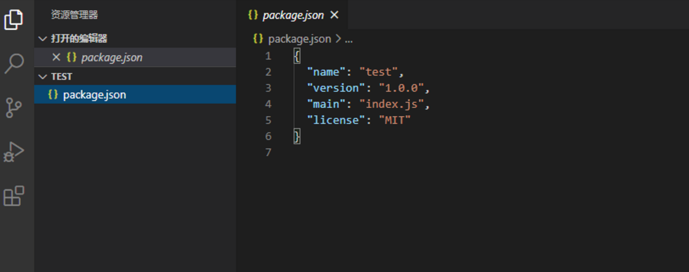<br/>

`package.json` 用于管理包依赖关系。其他的如添加/删除/更新等命令用于管理 `package.json` 和 `yarn.lock`。


###  添加一个依赖

使用 `yarn add` 命令，如添加vue-cli依赖：

```
yarn add vue-cli
```

如果不写版本号，默认安装最新版本，如果需要安装指定版本，请按照如下格式添加依赖：

```
yarn add vue-cli@x.x.x
```

此操作将自动在 `package.json`中添加对应的依赖，同时更新yarn.lock文件的版本信息。

我们还可以添加依赖到其他类型的依赖关系如：

```js
yarn add --dev 添加到 devDependencies
yarn add --peer 添加到 peerDependencies
yarn add --optional 添加到 optionalDependencies
```

具体的依赖关系类型，yarn的官网列举如下：
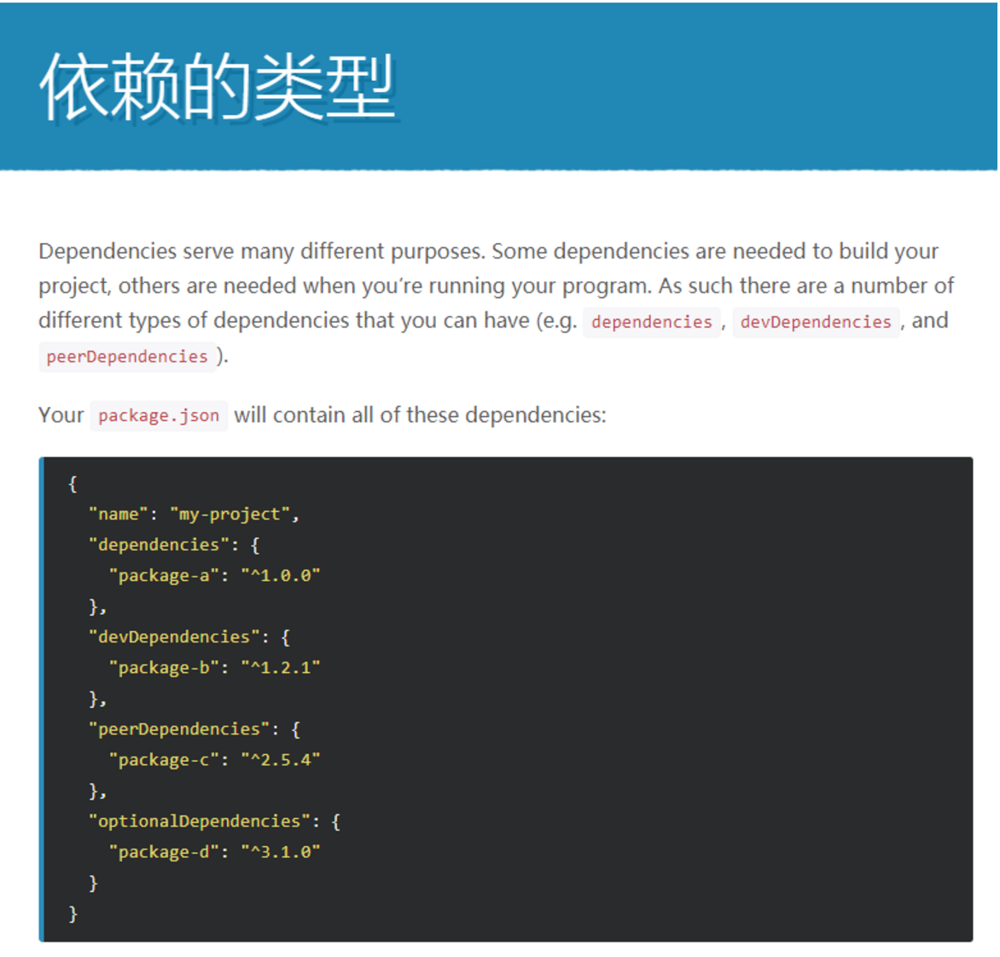<br/>

最后，我们执行 `yarn add vue-cli`，出现 success信息，并提示我们具体安包的数量，说明依赖安装成功 效果如图：
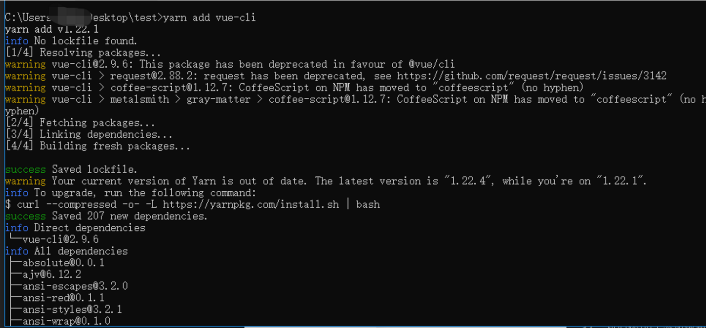<br/>

我们可以看到我们的`package.json`文件中多出了预想的依赖信息，并且项目目录中多出了 `node_modules` 文件夹，所有的依赖相关文件都被安装在了这个文件夹中，大功告成！
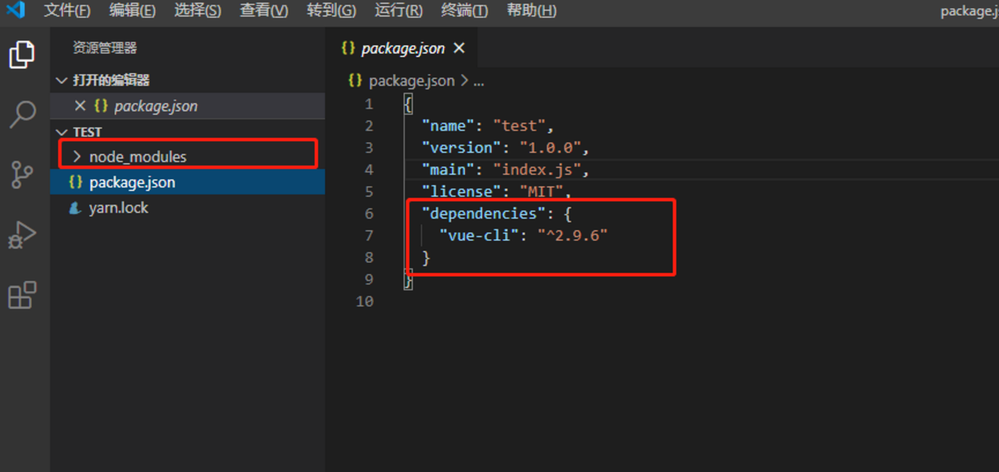<br/>


###  使用yarn更新依赖

`yarn` 更新依赖使用的是 `yarn upgrade [package]` 命令，也有一些需要注意得使用点。
首先我们初始化一个 webpack依赖，指定版本号为3.5.0

```
yarn add webpack@3.5.0
```

此时 `package.json` 中修改为

```
"dependencies": {
    "webpack": "3.5.0"
  }
```

然后我们使用 yarn 命令尝试去更新 webpack 依赖

```
yarn upgrade webpack
```

虽然控制台没有任何报错，也提示更新成功，但是我们的 `package.json` 中的配置还是

```
"dependencies": {
    "webpack": "3.5.0"
  }
```

注意：`yarn upgrade` 是按你指定的版本区间升级的，你可以使用 --latest 参数升级到最新版，无视 package.json 中的版本区间。

```
yarn upgrade webpack --latest
"dependencies": {
    "webpack": "4.43.0"
  }
```

这样就达到我们想升级依赖到最新版本的目的。

现在示例的是一个依赖，如果有多个依赖，想同时升级到最新版本，需要执行如下命令：

```
yarn upgrade-interactive
```


###  使用yarn删除依赖

使用yarn删除依赖的命令为 `yarn remove`。

从当前项目中删除依赖项：

```
yarn remove lodash
```

一次从所有工作空间中删除一个依赖项：

```
yarn remove lodash --all
```

删除所有以开头的依赖项eslint-：

```
yarn remove 'eslint-*'
```

删除@babel范围内的所有依赖项：

```
yarn remove '@babel/*'
```

删除所有匹配的依赖项react-dom或react-helmet ：

```
yarn remove 'react-{dom,helmet}'
```

####  临时修改（只生效一次）:

使用 npm 时，因为速度很慢，我们可以使用修改下载源的方式提升下载速度。同样的，使用 yarn 如果有需要，我们同样可以修改下载源(淘宝镜像)。

```
yarn save [package] --registry https://registry.npm.taobao.org/
```

####  设置yarn的配置项（全局配置）:

查看yarn源的当前地址

```
yarn config get registry
```

设置淘宝镜像

```
yarn config set registry https://registry.npm.taobao.org/
```